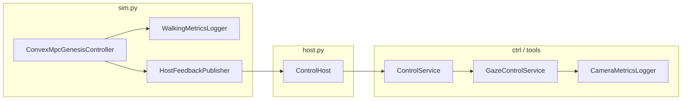
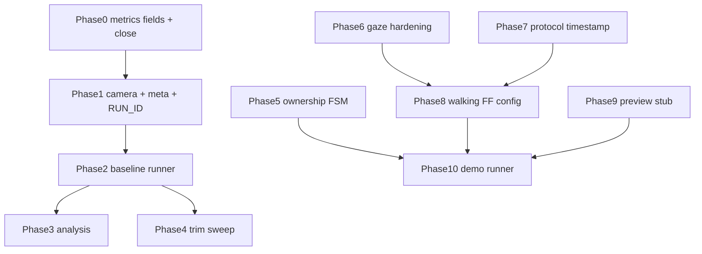

# Disturbance-aware Preview MPC Experiment Framework

## Research validation target (this phase)

This framework validates **dynamic task-space / camera-space stabilization during quadruped locomotion** — not object grasping.

**Claims under test:**
1. GO2 locomotion introduces periodic base disturbances that degrade EE/camera task-space stability.
2. The continuum arm has residual delay/hysteresis/drift vs nominal PCC.
3. A lightweight gray-box residual model can capture part of unmodeled arm behavior (later).
4. Disturbance-aware Preview MPC (interface first) can reduce EE/camera tracking error vs `off`, `uv`, `uv_ff`.

**Core metrics (primary):** `u_err`/`v_err` RMS, EE RMSE if available, `target_lost_frame_count`, `target_lost_event_count`, visible time ratio, gait-frequency image-error amplitude, phase lag, control effort/jerk, computation time per step.

**Not primary metrics:** grasp success rate, LJI completion, stop-and-grasp timing.

---

## Scope boundary (hard constraints)

| In scope | Out of scope |
|----------|--------------|
| Walking disturbance logging | Grasp, stop-and-grasp, LJI grasp |
| Camera/UV gaze ablation (`off` / `uv` / `uv_ff` / later `preview` stub) | `start_look_aim_grasp_e2e()` in any new demo |
| Pitch-trim / COM evaluation | Automatic gaze→grasp handoff |
| Baseline + analysis + presentation demos | Changing existing Look/Aim/LJI behavior |

**Frozen pipelines (must remain unchanged):**
- [`engine/controller/actions.py`](engine/controller/actions.py) — `start_look`, `start_aim`, `start_look_aim_grasp_e2e`, LJI workers
- Existing Visual Servoing / pick UI paths
- `ControlService.start_demo4_stop_and_grasp()` may remain in codebase but **must not be called** by new experiment tools

Future application note only: stabilized gaze *may later* connect to LJI — not implemented or evaluated in this phase.

---

## Current State (do not re-implement)


| Component                  | Status     | Key files                                                                                                                                                |
| -------------------------- | ---------- | -------------------------------------------------------------------------------------------------------------------------------------------------------- |
| Walking CSV logger         | ~80%       | `[engine/go2_mpc/walking_metrics.py](engine/go2_mpc/walking_metrics.py)`                                                                                 |
| Camera CSV logger          | partial | same file + `[engine/controller/gaze_service.py](engine/controller/gaze_service.py)`                                                                     |
| Convex MPC instrumentation | done       | `[engine/go2_mpc/controller.py](engine/go2_mpc/controller.py)`, `[engine/go2_mpc/control_rate.py](engine/go2_mpc/control_rate.py)`                       |
| Arm pose presets           | done       | `[engine/go2_locomotion/arm_pose_presets.py](engine/go2_locomotion/arm_pose_presets.py)`                                                                 |
| Payload pitch trim         | done       | `[engine/go2_mpc/payload_model.py](engine/go2_mpc/payload_model.py)`, config keys in `[config.ini](config.ini)`                                          |
| Gaze UV + base FF          | done       | `[engine/gaze_stabilizer/controller.py](engine/gaze_stabilizer/controller.py)`, `[engine/controller/gaze_service.py](engine/controller/gaze_service.py)` |
| GO2 base protocol          | done       | `[engine/protocol.py](engine/protocol.py)`, `[sim.py](sim.py)`, `[host.py](host.py)`                                                                     |
| Control ownership          | skeleton   | `[engine/controller/control_ownership.py](engine/controller/control_ownership.py)` — gaze only                                                           |
| Baseline runner            | stub       | `[tools/walking_baseline.py](tools/walking_baseline.py)` — meta only                                                                                     |
| Analysis                   | partial    | `[tools/analyze_walking_metrics.py](tools/analyze_walking_metrics.py)`                                                                                   |
| Preview MPC                | missing    | —                                                                                                                                                        |
| Demo runner                | missing    | `[tools/demo_walking_gaze.py](tools/demo_walking_gaze.py)` is print-only                                                                                 |





---

## Cross-cutting: run_id sync and lifecycle

**Rule:** `ELESIM_RUN_ID` is read **only by `sim.py` at startup** (and mirrored read-only by ctrl-side loggers). Experiment scripts **never set or export** it — they only **validate** that `--run-id` matches the env var visible to the already-running sim process.

```bash
export ELESIM_WALKING_METRICS=1
export ELESIM_RUN_ID=exp_baseline_bent_upward_backward_001
```

**Changes:**

- [`walking_metrics.py`](engine/go2_mpc/walking_metrics.py): `from_env()` reads `ELESIM_RUN_ID` when `run_id` arg omitted
- [`sim.py`](sim.py): pass `meta` with preset/motion into `WalkingMetricsLogger.from_env()` when env vars set; call `metrics.close()` in `_cleanup()`
- [`gaze_service.py`](engine/controller/gaze_service.py): default `run_id` from `ELESIM_RUN_ID` (read-only)
- New helper [`engine/experiment/run_context.py`](engine/experiment/run_context.py): `RunContext` writes `{run_id}_meta.json`; `validate_env_run_id(--run-id)` warns or fails on mismatch

**Camera lost-target naming (canonical):**

| Field | Meaning |
|-------|---------|
| `target_lost_frame_count` | Cumulative count of ticks/frames where `target_visible=false` |
| `target_lost_event_count` | Count of visible→invisible transitions (discrete loss events) |

Deprecated alias: `target_lost_count` → migrate to `target_lost_frame_count` in CSV + analyzer (one release backward-compat read).

**User workflow (manual stack):**

```bash
# T1: host.py --config config.ini
# T2: ELESIM_WALKING_METRICS=1 ELESIM_RUN_ID=exp_..._001 sim.py --config config.ini
# T3: python tools/walking_baseline.py --run-id exp_..._001 --preset bent_upward ...
```

---

## Phase 0 — Walking metrics completion

**Goal:** Log-only; no controller behavior change.

Extend `[WALKING_CSV_FIELDS](engine/go2_mpc/walking_metrics.py)` to match spec (keep old names as aliases or migrate in one pass):


| Spec field                                          | Action                                                                      |
| --------------------------------------------------- | --------------------------------------------------------------------------- |
| `wall_time_s`                                       | rename/add alongside `time_s`                                               |
| `sim_time_s`                                        | pass from `ConvexMpcGenesisController._sim_time`                            |
| `sim_hz_est`                                        | `1/dt` or rolling estimate                                                  |
| `ctrl_hz_config`, `ctrl_hz_effective`, `ctrl_decim` | from `ControlRateInfo` each row                                             |
| `torque_recomputed`, `torque_hold_active`           | alias `torque_update_flag`, `torque_hold_flag`                              |
| `torque_update_count`                               | flush from `WalkingMetricsCounters` into meta on `close()`                  |
| `base_lin_vel_body_`*, `base_ang_vel_body_*`        | rename world-frame fields in CSV to body (already computed in `sample_go2`) |
| `arm_q_*`                                           | alias existing `arm_linear_m` etc.                                          |


Instrument `[controller.py](engine/go2_mpc/controller.py)` `_record_metrics_sample()` to pass `sim_time_s` and `control_rate_info`. Document in meta when `mpc_ctrl_hz > sim_hz` that effective rate is capped.

Add `[tests/test_walking_metrics.py](tests/test_walking_metrics.py)`: mock entity row shape, `from_env` gating, `close()` counter flush.

---

## Phase 1 — Camera metrics + meta

Extend `[CameraMetricsLogger](engine/go2_mpc/walking_metrics.py)`:

- Add `wall_time_s` (primary) + optional `sim_time_s`
- Log rows when `target_visible=False`; increment **`target_lost_frame_count`** each lost tick; bump **`target_lost_event_count`** on visible→invisible edge; keep `time_since_last_seen`

Wire in `[gaze_service.py](engine/controller/gaze_service.py)` tick loop:

- sample on every tick (visible or not)
- pass `sim_time_s` from `host.go2_base_timestamp_s` if available

Extend `[WalkingMetricsMeta](engine/go2_mpc/walking_metrics.py)` / `RunContext`:

- `go2_motion`, `gaze_mode`, `notes`, `git_commit`

---

## Phase 2 — Arm presets + baseline runner (manual stack)

**Presets:** already in `[arm_pose_presets.py](engine/go2_locomotion/arm_pose_presets.py)` — verify q maps match `ControlService.state.set_q` + `send_current_target(source="experiment")`.

Rewrite `[tools/walking_baseline.py](tools/walking_baseline.py)`:

```bash
python tools/walking_baseline.py \
  --config config.ini \
  --run-id exp_baseline_bent_upward_backward_001 \
  --preset bent_upward \
  --motion backward \
  --duration 15 \
  --vx -0.2 \
  --repeat 3 \
  --run-prefix exp_baseline \
  --gaze off|uv|uv_ff \
  --headless-hint   # prints enable_viewer=false reminder
```

**Runner logic (ControlService only, pattern from `[tools/profile_pick_e2e.py](tools/profile_pick_e2e.py)`):**

1. Assert ZMQ host reachable (`ControlClient.refresh_state()`)
2. **`RunContext.validate_env_run_id(--run-id)`** — fail/warn if `os.environ["ELESIM_RUN_ID"] != --run-id` (baseline does **not** set or export `ELESIM_RUN_ID`)
3. Write meta via `RunContext` for the validated `--run-id`
4. Apply arm preset via `arm_pose_as_q` + `send_current_target`
5. Optional gaze: `start_gaze_stabilizer_standing/walking` with matching mode
6. Loop: `client.send_go2_vel(vx,vy,wz)` for `--duration`
7. Stop gaze, zero `go2_vel`, print log paths

**`--repeat N` semantics (v1):**

- One `run_id` = one sim process lifetime. Repeats are **separate trials**, not N segments in one sim session.
- With `--repeat 3` and `--run-prefix exp_foo`, the script schedules trial IDs: `exp_foo_001`, `exp_foo_002`, `exp_foo_003` (or `{run_prefix}_{preset}_{motion}_{trial:03d}` if documented in CLI help).
- **Per trial:** user must (a) set `ELESIM_RUN_ID` to that trial’s id, (b) **restart `sim.py`**, (c) run baseline once with matching `--run-id` (or script runs one trial per invocation with `--trial-index`).
- Default implementation: **`--repeat` loops sequentially**; before each trial it prints required `export ELESIM_RUN_ID=...` + sim restart instructions and **blocks** until env matches (or exits with checklist for manual re-run).
- Baseline never appends multiple trials into one walking CSV.

**5 baseline conditions** map to `BASELINE_SCENARIOS` indices 0–4 (neutral fwd/bwd, bent_upward bwd/fwd, bent_side turn).

**Note:** Walking CSV is sim-side — user must start sim with `ELESIM_WALKING_METRICS=1` and **matching** `ELESIM_RUN_ID` before each trial.

---

## Phase 3 — Analysis script completion

Extend `[tools/analyze_walking_metrics.py](tools/analyze_walking_metrics.py)`:

- Use `_nearest_merge()` in `summarize_run()` for cross-correlations
- Full summary JSON fields: `pitch_rms`, `roll_rms`, `max_abs_pitch/roll`, `tau_max_abs`, `tau_saturation_ratio`, `fall_detected`, `visible_time_ratio`, **`target_lost_frame_count`**, **`target_lost_event_count`**, `u_rms`, `v_rms`, `max_abs_u/v`, `corr_pitch_v`, `corr_roll_u`
- Plots: pitch+roll time series, u/v errors, optional gait-band FFT later
- CLI: `--latest`, `--compare run_a run_b run_c` → markdown/JSON comparison table
- Write `{run_id}_merged.csv` optional debug artifact

Add `[tests/test_analyze_walking_metrics.py](tests/test_analyze_walking_metrics.py)` with synthetic CSV fixtures.

---

## Phase 4 — Pitch trim sweep

**Already implemented:** `payload_pitch_trim_rad(com_body, vx, config)` with `kx_forward`, `kx_backward`, `kz`, `z_ref`, `max_rad` in [`payload_model.py`](engine/go2_mpc/payload_model.py).

**v1 constraint — sim restart required:** Pitch-trim gains are loaded from `config.ini` at **sim startup** (MPC init). There is **no** safe runtime trim override in v1. Each sweep case requires:

1. Edit `mpc_pitch_trim_*` keys in ini (or use a separate ini copy per case)
2. **Stop and restart `sim.py`** with a new `ELESIM_RUN_ID`
3. Run `walking_baseline.py` for that case
4. Compare summaries in `analyze_walking_metrics.py`

Do **not** implement `ELESIM_PITCH_TRIM_JSON` or baseline-side live config mutation unless a verified host config-update protocol is added later.

**Work:**

- Verify [`engine/tests/test_payload_pitch_trim.py`](engine/tests/test_payload_pitch_trim.py) covers forward/backward sign
- Add `tools/pitch_trim_sweep.sh` (or baseline `--print-trim-sweep-checklist`) documenting the grid and restart workflow — **orchestration only**, not hot reload
- Document success criteria in analysis: ≥30% pitch RMS reduction for `bent_upward+backward` vs `kx=kz=0` baseline; no regression on `visible_time_ratio`, `target_lost_event_count`, or u/v RMS (+20% cap)

No changes to external `convex_mpc` package.

---

## Phase 5 — Control ownership (gaze-only, opt-in)

Evolve [`control_ownership.py`](engine/controller/control_ownership.py) for **experiment gaze workers only**:

```python
class ControlState(Enum): IDLE, GAZE_TRACK, WALK_APPROACH, DONE, FAILED
```

(`ControlOwner` enum may retain `LOOK`/`AIM`/`GRASP_LJI` for future use but **not wired** in this phase.)

API additions: `current_state()`, `heartbeat(owner)`, `acquire(owner, state)`, timeout → `FAILED` + auto-release.

**Integrate (gaze only — no production pipeline changes):**

- [`gaze_service.py`](engine/controller/gaze_service.py): `try/finally` release; align with new API
- Optional singleton on `ControlService._ownership` when `[experiment] ownership_enable = true` (default **false**)

**Explicitly do NOT integrate:** `start_look`, `start_aim`, `start_look_aim_grasp_e2e`, LJI workers — existing behavior must be unchanged when ownership is disabled.

Tests: extend [`engine/tests/test_control_ownership.py`](engine/tests/test_control_ownership.py) — mutual exclusion, exception release, timeout.

---

## Phase 6 — Standing UV-only gaze (hardening)

Core exists. Remaining work:

- Extract `GazeStabilizerConfig` to `[engine/gaze_stabilizer/config.py](engine/gaze_stabilizer/config.py)`; load from `[config.ini](config.ini)` `[gaze_stabilizer]` via `[config_loader.py](engine/config_loader.py)` (keys already partially present)
- Ensure standing mode: `enable_base_ff=False`, linear axis not commanded (`du` = roll/s1/s2 only) — verify in `GazeStabilizer.compute_display_u_delta`
- Tests `[tests/test_gaze_stabilizer.py](tests/test_gaze_stabilizer.py)`: sign convention `s = obs_uv - target_uv`, mocked Jacobian, rate limits, ownership reject

---

## Phase 7 — Protocol GO2 base state (hardening)

Mostly done. Gaps to close:

- Add `go2_base_timestamp_s` to `[pack_state](engine/protocol.py)` if missing on wire
- `[HostState](engine/controller/state.py)` + `[client.py](engine/controller/client.py)` parse it
- `[sim.py](sim.py)` `send_go2_base()` include timestamp from sim clock
- Gaze uses timestamp for latency estimate (log only in v1)

Regression test: non-GO2 config does not require fields.

---

## Phase 8 — Walking base-feedforward gaze (hardening)

Already in `[GazeStabilizer](engine/gaze_stabilizer/controller.py)`:

```python
du = du_feedback + K_base @ ang_vel_body  # additive only
```

**Work:**

- Map config keys to spec names (`gaze_k_uv_u/v`, `gaze_k_base_pitch/roll/yaw`, `gaze_max_du_`*, `gaze_clamp_go2_vel_on_large_error`)
- Walking baseline `--gaze uv_ff` sets `gaze_enable_base_ff=true`
- Analysis compares `off` vs `uv` vs `uv_ff` via `--compare`

---

## Phase 9 — Preview MPC placeholder

Create (no runtime connection by default):

- `[engine/gaze_stabilizer/preview_model.py](engine/gaze_stabilizer/preview_model.py)` — `PreviewGazeState`, `PreviewGazeModel` with `s_next = s + J_uv @ du + B_base @ d_hat`
- `[engine/gaze_stabilizer/preview_mpc.py](engine/gaze_stabilizer/preview_mpc.py)` — `PreviewMpcController.solve()` → `NotImplementedError` or fallback to UV+FF
- `[tests/test_preview_mpc_dims.py](tests/test_preview_mpc_dims.py)` — dimension/unit tests only

---

## Phase 10 — Demo runner (stabilization only, no grasp)

Create [`tools/demo_gaze_walking.py`](tools/demo_gaze_walking.py) (replace/deprecate print-only [`demo_walking_gaze.py`](tools/demo_walking_gaze.py)):


| Demo | Behavior |
| ---- | -------- |
| `standing_gaze` | GO2 standing, gaze `uv`, report u/v RMS |
| `walking_compare` | loop conditions `off,uv,uv_ff` with shared motion + analyzer compare |
| `walking_approach_no_grasp` | walk toward visible target, gaze keeps FOV, stop by duration/distance — **no grasp** |
| `dynamic_gaze_stabilization` | presentation: trot + arm compensation, compare off vs uv vs uv_ff |

**Do NOT implement or invoke:** `stop_grasp`, `start_look_aim_grasp_e2e`, LJI handoff, grasp success reporting.

Demos use gaze ownership (Phase 5) only when `ownership_enable=true`.

---

## Implementation order (small testable steps)




---

## Validation checklist

1. `python -m unittest tests.test_walking_metrics tests.test_control_ownership tests.test_gaze_stabilizer tests.test_payload_pitch_trim`
2. Manual stack: host + sim (`ELESIM_WALKING_METRICS=1`) + `walking_baseline.py --duration 5`
3. `analyze_walking_metrics.py --log-dir logs/walking_baseline --latest`
4. `demo_gaze_walking.py --demo standing_gaze --gaze uv_only`

---

## Known limitations (document in README snippet)

- Walking CSV requires sim process; baseline cannot log GO2 pose without pre-started sim
- **One `run_id` per sim process**; `--repeat` = multiple trials with sim restart + new `ELESIM_RUN_ID` each
- **Pitch-trim sweep requires sim restart per case** (no runtime trim override in v1)
- Metrics only fully instrumented for `convex_mpc` mode (Raibert logs minimal or none — extend later if needed)
- Preview MPC not connected; UV+baseFF is the v1 gaze ceiling
- Ctrl-side `sim_time_s` may be empty; merge uses `wall_time_s`
- Ownership FSM off by default; gaze-only when enabled
- **No grasp/LJI validation** in this framework; existing Look/Aim/LJI paths frozen

## Assumptions

- Experiments use `config.ini` with `mode=convex_mpc`, `use_go2=true`, `enable_viewer=false` for headless
- Perception target visible via existing sim camera + perception capture (local or remote)
- [`start_look_aim_grasp_e2e()`](engine/controller/actions.py) and LJI workers remain available in product UI but are **not called or modified** by experiment tooling

