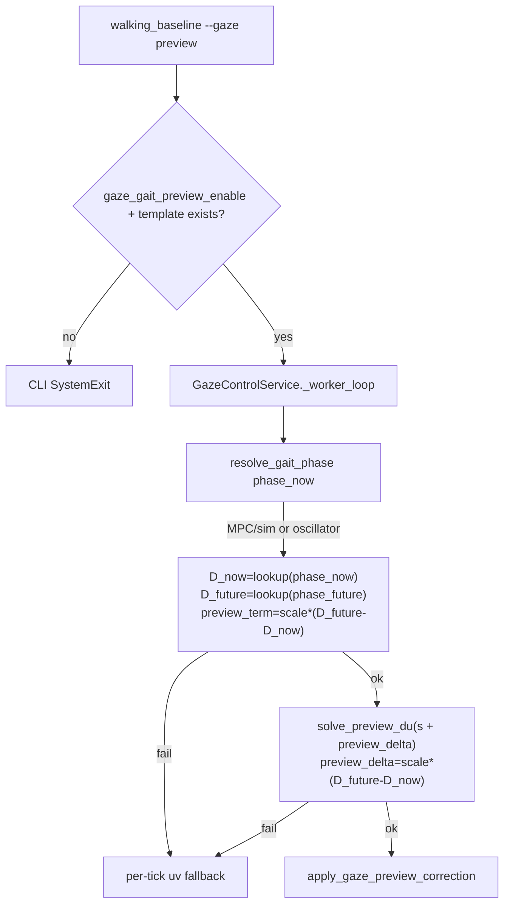

# Gait-phase Preview MPC-lite

## 목표

Presentation claim에 맞게 `--gaze preview`의 disturbance를 **pitch-rate lead가 아닌 gait-phase indexed template** `D(φ) = [D_u(φ), D_v(φ)]`로 바꿉니다.

### 핵심 제어식 (delta disturbance)

현재 이미지 오차 `s = [u_err, v_err]`에는 **이미 현재 phase의 gait disturbance `D_now`가 포함**되어 있습니다. Preview term은 horizon 동안 disturbance가 **얼마나 변할지**를 예측해야 하므로 **절대값 `D_future`가 아니라 변화량**을 사용합니다:

```text
D_now    = template.lookup(phase_now)
D_future = template.lookup(phase_future)
preview_term = scale * (D_future - D_now)

du = -(Jᵀ Q J + R)⁻¹ Jᵀ Q (s + preview_term)
```

여기서 `phase_future = (phase_now + preview_horizon_s / gait_period_s) % 1.0`.

**금지:** `preview_term = scale * D_future` — `s`에 `D_now`가 이미 들어 있으므로 double-counting.



**범위 밖:** Look/Aim/LJI/grasp, horizon MPC, pitch-rate lead (gait preview 모드에서 미사용).

### 최종 데이터 흐름

```text
off logs
→ gait-phase disturbance template D(φ)
→ runtime phase φ (build와 동일 convention)
→ future phase φ + Δφ
→ preview_delta = D(φ+Δφ) - D(φ)
→ one-step MPC-lite solve
→ gait-phase preview result
```

---

## 0. Phase convention 통일 (필수)

**Template build와 runtime이 서로 다른 phase zero를 쓰면 phase-shifted compensation이 되어 결과가 망가집니다.** 양쪽 모두 아래 **동일 우선순위**를 사용합니다.

| 우선순위 | 소스 | 계산 |
|---------|------|------|
| 1 | `go2_gait_phase` | merged walking/host 값 그대로 `% 1.0` |
| 2 | `sim_time_s % gait_period_s` | `(sim_time_s % period) / period` (MPC sim clock) |
| 3 | wall-time oscillator | `((wall_time_s - t0) / gait_period_s + phase_offset) % 1.0` (최후 fallback) |

- Sim MPC 정의 ([`controller.py`](engine/go2_mpc/controller.py)): `phase = (sim_time % gait_period) / gait_period`
- **금지:** template만 `run 시작 t0` 기준, runtime만 `sim_time % period` — zero anchor 불일치
- Template JSON `metadata`에 convention 기록 (runtime이 로드 시 검증):

```json
{
  "metadata": {
    "phase_source": "go2_gait_phase | sim_time_mod_period | wall_time_from_run_start",
    "phase_anchor": "sim_time_zero | run_first_sample",
    "gait_period_s": 0.4,
    "num_bins": 32,
    "phase_offset": 0.0,
    "runs": [...],
    "vx_nominal": 0.35
  }
}
```

- Runtime [`resolve_gait_phase`](engine/gaze_stabilizer/gait_phase_preview.py): template `metadata.phase_source`와 가능한 한 동일 경로 사용; `gait_period_s` 불일치 시 warn 또는 fail-fast (config vs template metadata).

---

## 1. Config

[`engine/gaze_stabilizer/config.py`](engine/gaze_stabilizer/config.py)에 gait preview 필드 추가:

| 필드 | INI 키 | 기본값 |
|------|--------|--------|
| `gait_preview_enable` | `gaze_gait_preview_enable` | `false` |
| `gait_period_s` | `gaze_gait_period_s` | `0.0` (0이면 MPC `gait_hz`에서 유도) |
| `gait_phase_offset` | `gaze_gait_phase_offset` | `0.0` |
| `gait_preview_horizon_s` | `gaze_gait_preview_horizon_s` | `0.08` |
| `gait_template_path` | `gaze_gait_template_path` | `""` |
| `gait_template_bins` | `gaze_gait_template_bins` | `32` |
| `gait_preview_scale` | `gaze_gait_preview_scale` | `1.0` |

- [`engine/config_loader.py`](engine/config_loader.py): 위 키 로딩 + **`gait_period_s == 0`이면** [`Go2LocomotionConfig.gait_hz`](engine/go2_locomotion/config.py) / [`Go2MpcConfig.gait_period_s`](engine/go2_mpc/config.py)에서 `1/gait_hz` 유도 (사용자 선택: MPC 동기화).
- [`config.ini`](config.ini), `config.pc.ini`, `config.jetson.ini`: gait preview 블록 추가; 기존 `gaze_preview_enable` / `gaze_preview_b_pitch`는 deprecated 주석만 남기고 **CLI gate는 `gaze_gait_preview_enable`로 전환**.
- Solver weight 키(`gaze_preview_q_*`, `gaze_preview_r_*`, `gaze_preview_max_du_*`)는 그대로 재사용.

---

## 2. Gait phase 소스 (sim → host → gaze)

### Sim / walking CSV

[`engine/go2_mpc/controller.py`](engine/go2_mpc/controller.py) `_record_metrics_sample`:

```python
period = float(self._gait.gait_period)
phase = (float(self._sim_time) % period) / period if period > 0 else 0.0
```

[`engine/go2_mpc/walking_metrics.py`](engine/go2_mpc/walking_metrics.py):
- `WALKING_CSV_FIELDS`에 `go2_gait_phase`, `go2_gait_period_s` 추가
- `sample_go2(..., go2_gait_phase=..., go2_gait_period_s=...)` 확장

### Sim → host protocol

[`sim.py`](sim.py) `Go2Locomotion`에 `gait_phase_s()` / `gait_period_s()` 추가 (convex controller `_gait`, `_sim_time` 읽기).

[`HostFeedbackPublisher.send_go2_base`](sim.py): optional `go2_gait_phase`, `go2_gait_period_s` 전송.

[`engine/controller/state.py`](engine/controller/state.py) `HostState`, [`engine/controller/client.py`](engine/controller/client.py) 파싱, [`engine/protocol.py`](engine/protocol.py) optional 필드.

### Gaze worker phase resolver

[`engine/gaze_stabilizer/gait_phase_preview.py`](engine/gaze_stabilizer/gait_phase_preview.py) — **§0 우선순위와 동일**:

```python
def resolve_gait_phase(
    *,
    host_gait_phase: float | None,
    sim_time_s: float,
    wall_time_s: float,
    wall_t0_s: float,
    gait_period_s: float,
    phase_offset: float,
) -> tuple[float | None, str]:
    """Returns (phase, phase_source_tag)."""
    if host_gait_phase is not None and math.isfinite(host_gait_phase):
        return host_gait_phase % 1.0, "go2_gait_phase"
    if sim_time_s > 0 and gait_period_s > 0:
        return (sim_time_s % gait_period_s) / gait_period_s, "sim_time_mod_period"
    if wall_time_s > wall_t0_s and gait_period_s > 0:
        return ((wall_time_s - wall_t0_s) / gait_period_s + phase_offset) % 1.0, "wall_time_from_run_start"
    return None, ""
```

- Runtime: `host.go2_gait_phase` (sim feedback) 우선; else `host.go2_base_timestamp_s`를 `sim_time_s`로 사용해 priority 2 적용.
- `wall_t0_s`: gaze worker start 시 첫 유효 timestamp ([`gaze_service.py`](engine/controller/gaze_service.py) `_start()`).

---

## 3. Template 빌드 도구

신규 [`tools/build_gait_phase_template.py`](tools/build_gait_phase_template.py):

### 입력

```bash
PYTHONPATH=. python tools/build_gait_phase_template.py \
  --config config.ini \
  --log-dir logs/walking_baseline \
  --runs exp_gaze_off_neutral_forward_001 exp_gaze_off_neutral_forward_002 ... \
  --num-bins 32 \
  --trim-start-s 2.0 \
  --trim-end-s 2.0 \
  --vx-nominal 0.35 \
  --vx-tol 0.05 \
  --output logs/gait_templates/neutral_forward_vx035_template.json
```

- `--gait-period` 생략 시 config MPC `gait_hz` → `1/gait_hz` (~0.40s).
- `--runs`: `exp_gaze_off_neutral_forward_{001..010}` 10회 권장; alias `neutral_forward_off_*` 허용.

### Per-run 처리 (camera 단독 금지 — walking merge 필수)

```text
1. {run_id}_camera.csv 로드
2. {run_id}_walking.csv 있으면 sim_time_s 또는 wall_time_s 기준 nearest merge
3. merged row phase (§0 우선순위):
   a. go2_gait_phase (merged walking) → metadata phase_source=go2_gait_phase
   b. else sim_time_s % gait_period_s → sim_time_mod_period
   c. else (wall_time_s - run_t0) / period + offset → wall_time_from_run_start
4. transient / quality 필터:
   - wall_time_s - run_t0 < trim_start_s 제거
   - run_duration - (wall_time_s - run_t0) < trim_end_s 제거
   - target_visible == true
   - u_err, v_err finite
   - |go2_cmd_vx - vx_nominal| <= vx_tol (walking merge 시)
5. bin = int(phase * num_bins) % num_bins
6. u_demean = u_err - run_mean_u, v_demean = v_err - run_mean_v
```

**최소 필터 (기본 on):** 첫/끝 2s 제거, `target_visible=false` 제거, NaN 제거.

### 출력 JSON

```json
{
  "metadata": {
    "phase_source": "go2_gait_phase",
    "phase_anchor": "sim_time_zero",
    "gait_period_s": 0.4,
    "num_bins": 32,
    "phase_offset": 0.0,
    "trim_start_s": 2.0,
    "trim_end_s": 2.0,
    "runs": [...],
    "vx_nominal": 0.35
  },
  "u_template": [...],
  "v_template": [...],
  "sample_count": [...],
  "u_std": [...],
  "v_std": [...]
}
```

- 빈 bin: 인접 non-empty bin 선형 보간; 전체 empty → exit 1.

### Diagnostic plots (builder가 `--output` 옆에 저장)

`{output_stem}_phase_u.png`, `_phase_v.png`, `_sample_count.png`:
- phase vs `u_template` / `v_template` — **주기적 패턴이 보여야 함** (flat이면 preview 무효)
- sample_count per bin — coverage 확인

---

## 4. GaitPhasePreviewModel

신규 [`engine/gaze_stabilizer/gait_phase_preview.py`](engine/gaze_stabilizer/gait_phase_preview.py):

| 함수 | 역할 |
|------|------|
| `load_template(path)` | JSON 로드 + bin 수/metadata 검증 |
| `lookup(phase)` | bin 간 **선형 보간** → `D = (D_u, D_v)` |
| `phase_future(phase_now, horizon_s, period_s)` | `(phase_now + horizon_s/period_s) % 1.0` |
| `preview_delta(phase_now, scale, horizon_s, period_s)` | `D_now=lookup(phase_now)`, `D_future=lookup(phase_future)` → `scale * (D_future - D_now)` |
| `preview_term(...)` | `preview_delta` alias (delta만 반환; 절대 `D_future` 금지) |

`preview_delta` 반환 타입 예:

```python
@dataclass(frozen=True)
class GaitPreviewDelta:
    phase_now: float
    phase_future: float
    d_now: np.ndarray      # shape (2,)
    d_future: np.ndarray   # shape (2,)
    preview_term: np.ndarray  # shape (2,) = scale * (d_future - d_now)
    ok: bool
    reason: str
```

---

## 5. Preview solve / runtime 변경

[`engine/controller/gaze_service.py`](engine/controller/gaze_service.py) `_try_preview_step` **전면 교체**:

1. `GaitPhasePreviewModel`을 gaze start 시 `load_template(cfg.gait_template_path)`; metadata `gait_period_s` / `phase_source` 검증.
2. `phase_now, src = resolve_gait_phase(...)` — **§0과 template build 동일 우선순위**.
3. `delta = model.preview_delta(phase_now, scale, horizon_s, period_s)` (**pitch lead 제거**):
   - `D_now = lookup(phase_now)`, `D_future = lookup(phase_future)`
   - `preview_delta = scale * (D_future - D_now)` — **절대 `scale * D_future` 금지**
4. `solve_preview_du(jacobian, s, preview_delta, ...)` — 인자명/로그에서 `preview_term`과 동치이나 의미는 **delta만**.
5. `apply_gaze_preview_correction` (linear 고정, 기존 clip 유지).

**동작 sanity check:** `phase_future ≈ phase_now`이면 `preview_term ≈ 0` (horizon 매우 짧거나 period 매우 긴 경우).

**Fallback reasons (per-tick → uv):** `missing_host`, `missing_ts`, `missing_gait_phase`, `template_lookup_fail`, `solve_fail`, `no_motion`.

**Tick stats / meta:** 기존 `preview_used_ratio`, `preview_fallback_ratio` 유지.

[`engine/experiment/run_context.py`](engine/experiment/run_context.py) meta 필드 추가:
- `preview_type = "gait_phase"`
- `gait_period_s`, `preview_horizon_s`, `gait_template_path`

---

## 6. Logging

### Camera CSV ([`walking_metrics.py`](engine/go2_mpc/walking_metrics.py))

`CAMERA_CSV_FIELDS` 갱신 — gait preview 필수 컬럼:

```
gait_phase, gait_phase_future,
gait_template_u_now, gait_template_v_now,
gait_template_u_future, gait_template_v_future,
preview_term_u, preview_term_v,
preview_used, preview_fallback, preview_fallback_reason
```

- `gait_template_u/v_now` = `D_now`; `gait_template_u/v_future` = `D_future`; `preview_term_*` = `scale * (D_future - D_now)`.
- (이전 계획의 단일 `gait_template_u/v`는 now/future 분리로 대체.)
- pitch 전용 컬럼(`pitch_rate`, `b_pitch` 등)은 **비우거나 제거** (breaking change 최소화: 컬럼은 유지하되 gait 모드에서 empty/0).
- `gaze_service._log_camera_sample` 시그니처/호출부 업데이트.

---

## 7. CLI / experiment safety

[`tools/walking_baseline.py`](tools/walking_baseline.py) `_validate_gaze_config`:

```python
if gaze == "preview":
    if not cfg.gait_preview_enable:
        raise SystemExit("preview requested but gaze_gait_preview_enable=false")
    path = Path(cfg.gait_template_path)
    if not path.is_file():
        raise SystemExit(f"preview requested but gait template missing: {path}")
    # optional: template metadata gait_period_s vs resolved cfg.gait_period_s mismatch warn/exit
```

- [`tools/demo_gaze_walking.py`](tools/demo_gaze_walking.py), [`tools/run_walking_baseline_batch.py`](tools/run_walking_baseline_batch.py), [`tools/run_preview_validation.py`](tools/run_preview_validation.py): 동일 gate.
- Trial 종료 시 `RunContext`에 gait meta + preview stats 기록.

---

## 8. Tests

| 파일 | 내용 |
|------|------|
| `tests/test_gait_phase_preview.py` (신규) | phase wrap, interpolation, empty-bin neighbor fill; **`phase_future≈phase_now` → `preview_term≈0`**; phase advance 시 `preview_term = scale*(D_future-D_now)` nonzero |
| `tests/test_build_gait_phase_template.py` (신규) | camera+walking merge; phase priority; trim/filter; JSON metadata; synthetic periodic template → plots |
| `tests/test_preview_mpc_lite.py` | gait `preview_term`로 solve smoke 추가 |
| `tests/test_walking_baseline_preview.py` | fail-fast: `gait_preview_enable=false`, missing template path |
| `tests/test_walking_metrics.py` | walking/camera 새 컬럼 존재 |
| `tests/test_run_context.py` | `preview_type=gait_phase` meta |

---

## 9. 마이그레이션 / 정리

- [`preview_lite.py`](engine/gaze_stabilizer/preview_lite.py) pitch lead: gaze preview 경로에서 **호출 제거** (파일 유지).
- [`tools/run_preview_b_pitch_sign.sh`](tools/run_preview_b_pitch_sign.sh), [`tools/analyze_preview_b_pitch_sign.py`](tools/analyze_preview_b_pitch_sign.py): deprecated — pitch-lead 결과는 비교 baseline으로만 보관.

### 구현 후 실험 순서

**1. Template 생성** (off 10회, transient trim)

```bash
PYTHONPATH=. python tools/build_gait_phase_template.py \
  --config config.ini \
  --log-dir logs/walking_baseline \
  --runs exp_gaze_off_neutral_forward_001 ... exp_gaze_off_neutral_forward_010 \
  --num-bins 32 \
  --trim-start-s 2.0 \
  --trim-end-s 2.0 \
  --output logs/gait_templates/neutral_forward_vx035_template.json
```

**2. Template plot 확인** — `v_template`이 phase에 대해 주기적인지; `sample_count` bin coverage.

**3. Gait-preview 3회** (`gaze_gait_preview_enable=true`, valid template path)

```bash
export ELESIM_RUN_ID=neutral_forward_gait_preview_001
python tools/walking_baseline.py \
  --run-id neutral_forward_gait_preview_001 \
  --preset neutral --motion forward --duration 60 --vx 0.35 --gaze preview
# 002, 003 동일
```

검증: `preview_used_ratio≈1`, `preview_fallback_ratio≈0`, camera CSV에 `preview_delta` diagnostics.

**4. 5-way 비교**

| Condition | 비고 |
|-----------|------|
| off | 기존 ablation |
| uv | 기존 ablation |
| uv_ff | 기존 ablation |
| pitch-lead preview | `neutral_forward_preview_pos_*` (이미 실행됨) |
| gait-phase preview | `neutral_forward_gait_preview_*` |

판단 기준:
- **최소 성공:** gait-phase v RMS < pitch-lead preview
- **좋은 성공:** gait-phase v RMS < uv_ff
- **매우 성공:** gait-phase v RMS ≈ uv 또는 더 낮음

---

## 주요 변경 파일

| 영역 | 파일 |
|------|------|
| Config | `config.py`, `config_loader.py`, `config.ini` |
| Phase model | `gait_phase_preview.py` (신규) |
| Template build | `build_gait_phase_template.py` (신규) |
| Sim phase expose | `controller.py`, `walking_metrics.py`, `sim.py`, `state.py`, `client.py`, `protocol.py` |
| Runtime | `gaze_service.py` |
| Meta/CLI | `run_context.py`, `walking_baseline.py` |
| Tests | `test_gait_phase_preview.py`, 기존 preview tests 갱신 |
