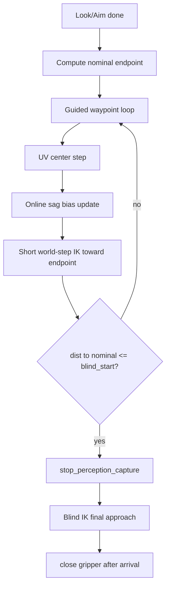

# Grasp guided waypoint approach

## 현재 문제

[`start_grasp()`](engine/controller/actions.py) → [`_start_grasp_to_object()`](engine/controller/actions.py)는 **한 번의 IK**로 `object - dir * grasp_standoff_m`에 도달합니다.

```2756:2780:engine/controller/actions.py
            grasp_target = compute_ready_pose_target(
                object_tuple,
                tuple(float(v) for v in direction),
                standoff_m=standoff_m,
            )
        ...
        self._start_ready_pose_resolve_and_solve(
            ...
            target_world=grasp_target,
            close_gripper_after=True,
        )
```

- Look/Aim 이후에도 perception/UV/sag 보정 없이 world target으로 직행
- equal_sag는 Aim 종료 시 1회만 적용 → 접근 중 drift 누적
- 장거리 IK 한 방 → UV 이탈·sag 오차가 grasp point에 그대로 반영

---

## 목표 동작



**원칙**
- `grasp_standoff` endpoint = **nominal reference only** (매 waypoint마다 perception object로 재계산)
- 전진 = FK grasp tip 기준 `grasp_waypoint_step_m` world step (사용자 선택)
- blind 구간 = perception off + 짧은 축방향 IK (기존 [`_pick_extend_cartesian`](engine/controller/actions.py) 패턴 재사용)

---

## 아키텍처

### Phase

[`ObjectPickPhase`](engine/controller/object_pick.py)에 `GRASP_APPROACH = "grasp_approach"` 추가 (UI/log 구분용). 최종 blind/closing은 기존 `GRASP` 유지.

### Config — [`config_loader.py`](engine/config_loader.py) + [`config.ini`](config.ini)

| 키 | 기본값 | 의미 |
|----|--------|------|
| `grasp_guided_enabled` | `true` | false면 legacy one-shot IK 유지 |
| `grasp_waypoint_step_m` | `0.03` | waypoint당 최대 전진 (world, approach axis) |
| `grasp_blind_start_m` | `0.06` | nominal endpoint까지 이 거리 이하 → perception stop |
| `grasp_blind_approach_m` | `0.02` | blind 구간 추가 전진 (보통 ≈ grasp_standoff) |
| `grasp_max_waypoints` | `20` | guided loop 상한 |
| `grasp_uv_center_tol` | `aim_center_tol` fallback | waypoint UV deadband |
| `grasp_online_sag_enabled` | `true` | waypoint마다 sag bias 갱신 |
| `grasp_online_sag_max_step_deg` | `2.0` | waypoint당 seg offset 변화 clip |

### 핵심 함수 (actions.py)

**1. `_compute_grasp_nominal_endpoint(object, dir, standoff)`**
- 기존 [`compute_ready_pose_target`](engine/visual_servoing/ready_pose.py) thin wrapper
- 매 waypoint에서 live `object_world`로 재호출

**2. `_grasp_update_online_sag_bias(host_state, object_world, approach_dir)`**
- FK tip vs `compute_ready_pose_target(object, dir, current_axial_standoff)` drift 계산
- [`estimate_equal_sag_from_ready_pose_drift`](engine/visual_servoing/equal_sag_probe.py) 재사용
- Aim 1회 latch(`_pick_equal_sag_attempted`)와 분리: grasp 전용 incremental state
- 이전 offset에 **clip된 delta** 적용 → `_pick_grasp_sag_model()` 갱신
- 거부 시 이전 bias 유지 (loop 중단 없음)

**3. `_grasp_uv_center_until_tol(obs, cfg)`**
- 기존 [`_apply_pick_center_step`](engine/controller/actions.py) + `_send_display_control_u_and_wait` 반복
- `grasp_uv_center_tol` 만족 또는 max micro-steps(예: 5)까지
- target_uv = Aim/Look latch (`PickConfig.target_uv_u/v`)

**4. `_grasp_advance_waypoint_ik(tip, dir, step_m, sag_model)`**
- [`_pick_extend_cartesian`](engine/controller/actions.py)와 동일하게 **sync** `ik_pipeline.solve_then_align`
- target = `tip + dir * min(step_m, dist_to_nominal - grasp_blind_start_m)`
- dir hold = current grasp direction
- 실패 시 waypoint abort → pick failed

**5. `_run_grasp_guided_approach_worker()`** (thread)
- perception running 확인 (`start_perception_capture` if needed)
- loop (max `grasp_max_waypoints`):
  1. obs fetch (stale → limited retry, Aim과 동일 lost_follow reuse optional)
  2. UV center micro-loop
  3. online sag update
  4. `object_world` = `_pick_grasp_object_world()` (centered > look > live)
  5. `nominal = compute_ready_pose_target(object, dir, grasp_standoff_m)`
  6. `dist = projection(tip → nominal along dir)`
  7. if `dist <= grasp_blind_start_m`: break
  8. `_grasp_advance_waypoint_ik(...)` + wait q settle (reuse `_wait_until_grasp_target_reached` with loose tol)
- `stop_perception_capture()`
- blind: `_grasp_blind_final_approach(nominal, dir, grasp_blind_approach_m)` — extend cartesian helper 일반화
- `_close_gripper_after_grasp_arrival()` (기존 pre-contact 검증 유지)

**6. `_start_grasp_to_object()` 분기**
```python
if pk.grasp_guided_enabled:
    self._start_grasp_guided_approach(...)
    return True
# legacy one-shot path (unchanged for A/B)
```

---

## 재사용 vs 신규

| 기존 | 용도 |
|------|------|
| `_apply_pick_center_step` | waypoint UV 유지 |
| `estimate_equal_sag_from_ready_pose_drift` | online sag |
| `ik_pipeline.solve_then_align` | waypoint + blind IK |
| `_wait_until_grasp_target_reached` | arrival gate |
| `_close_gripper_after_grasp_arrival` | gripper close |
| `stop_perception_capture` | blind 전환 |

신규: grasp guided state (`_grasp_waypoint_idx`, `_grasp_online_sag_model`, `_grasp_nominal_dir` latch)

---

## E2E / UI

- [`start_look_aim_grasp_e2e`](engine/controller/actions.py): `start_grasp()` 호출만 유지 → guided path 자동 적용
- [`ui/panels/perception.py`](ui/panels/perception.py): Grasp 설명 문구를 "guided waypoint + blind"로 갱신 (optional)

---

## 테스트

**[`tests/test_grasp_after_aim.py`](tests/test_grasp_after_aim.py)** 업데이트
- `grasp_guided_enabled=false` → 기존 one-shot mock 검증 유지
- `grasp_guided_enabled=true` → `_start_grasp_guided_approach` 호출 확인

**신규 `tests/test_grasp_guided_approach.py`**
- nominal endpoint 재계산 (object 이동 시 endpoint shift)
- dist <= blind_start 시 `stop_perception_capture` 호출
- online sag: drift 입력 시 offset 증가 (clip 확인)
- waypoint step이 `grasp_waypoint_step_m` 이하인지

---

## 트레이드오프

| | one-shot (legacy) | guided waypoint |
|--|--|--|
| UV 유지 | 없음 | 매 waypoint |
| sag 보정 | Aim 1회 | online incremental |
| 속도 | 빠름 | waypoint 수 × (UV settle + IK) |
| blind 구간 | 없음 | 마지막 2–6 cm perception off |

`grasp_guided_enabled=false`로 언제든 legacy 복귀 가능.

---

## 구현 순서

1. `PickConfig` + `config.ini` 키 추가
2. `ObjectPickPhase.GRASP_APPROACH` + helper 함수 4개
3. `_run_grasp_guided_approach_worker` + `_start_grasp_to_object` 분기
4. blind final approach (extend cartesian 일반화)
5. 테스트 + E2E smoke
