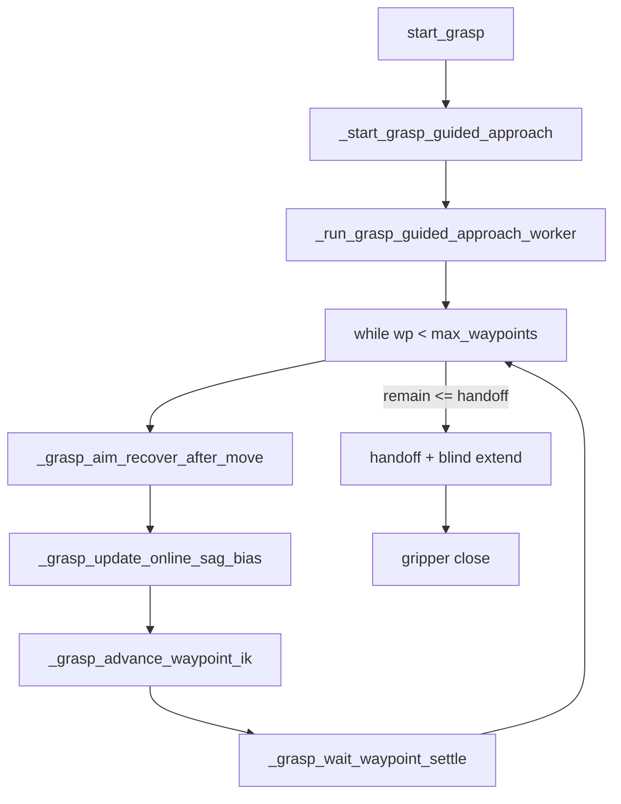
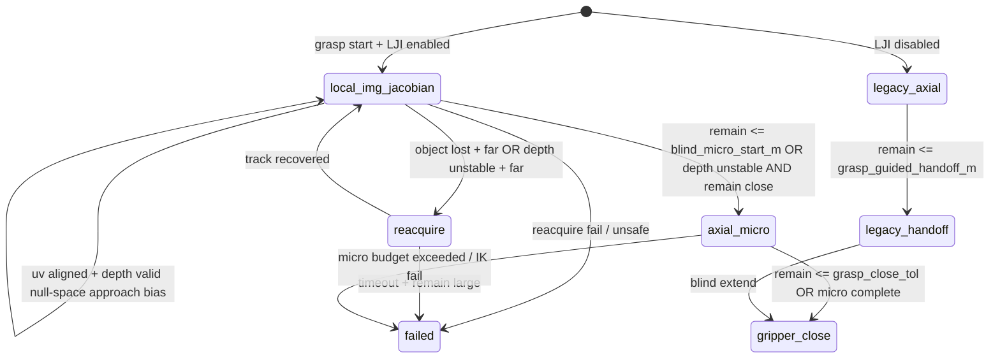

# Grasp Local Image Jacobian 전환 계획

## 현재 구조 (변경 대상)



핵심 루프: [`engine/controller/actions.py`](engine/controller/actions.py) `_run_grasp_guided_approach_worker` (L4990–5254)

- 매 waypoint: UV aim recover → online sag → **`_grasp_advance_waypoint_ik`** → settle
- Axial IK 실행: `_grasp_cartesian_advance_along_dir` (L4514) — **삭제/이동하지 않고** `axial_micro`·fallback·legacy blind에서 재사용
- Look 경로 (`start_look`, `_look_post_*`): **미변경**

---

## 구현 우선순위 (필수)

| 단계 | 내용 | 범위 |
|------|------|------|
| **1차** | 2D Local Image Jacobian `[u, v]` 기반 **정렬** | 필수, 첫 PR |
| **2차** | UV 정렬 충족 + depth-valid일 때만 **small approach bias** (z를 3D feature로 섞지 않음) | 필수, 첫 PR |
| **3차** | `depth unstable AND remain <= axial_micro_max_total_m + margin`일 때만 **axial_micro** | 필수, 첫 PR |
| **4차** | 필요 시 3D `[u, v, z]` **별도 estimator** 확장 | 선택, 후속 |

1~3차 완료 전에 3D 통합 estimator·`[u,v,z]` 동시 제어는 구현하지 않음.

---

## 목표 아키텍처

### Legacy path vs LJI path (분리)

| | Legacy (`local_img_jacobian_enabled=false`) | LJI path (`=true`) |
|---|---------------------------------------------|---------------------|
| 접근 제어 | aim recover → axial IK waypoint | 2D LJI 정렬 → (조건부) z bias → axial_micro |
| 종료/handoff | `grasp_guided_handoff_m` + blind extend (`_grasp_blind_final_approach`) | **`grasp_guided_handoff_m` blind handoff 사용 안 함** |
| LJI final insertion 시작 | — | `remain <= blind_micro_start_m` → **axial_micro / final insertion 시작** (gripper close 아님) |
| LJI gripper close | — | `remain <= grasp_close_tol` 또는 axial_micro 완료 후만 |



| Mode | 역할 | Axial IK 호출 |
|------|------|---------------|
| `local_img_jacobian` | 2D UV 정렬; 정렬 후 null-space approach bias | bias seed 계산에만 (small dq seed) |
| `axial_micro` | depth 불안정 **且** 충분히 가까울 때 마지막 삽입 | `_grasp_advance_waypoint_ik` (micro step) |
| `reacquire` | tracker lost 또는 depth unstable+멀 때 | blind push 금지 |
| `failed` | 안전 중단 | — |

`local_img_jacobian_enabled=false` → 기존 루프 + **`grasp_guided_handoff_m` blind handoff** 그대로.

---

## 1. 신규 모듈

**파일:** [`engine/visual_servoing/local_image_jacobian.py`](engine/visual_servoing/local_image_jacobian.py) (신규)

### `GraspApproachMode` (str Enum)
`local_img_jacobian`, `axial_micro`, `reacquire`, `failed`

### Image Jacobian 차원 (명시)

관계식:

```text
delta_s ≈ J_img @ delta_q
```

- `delta_q`: shape `(4,)` — `[linear, roll, theta1, theta2]`
- `delta_s`: shape `(m,)` — 1차: `m=2` (`[u_err, v_err]`)
- stacked LS: `Q: (N, 4)`, `S: (N, m)`
  ```python
  B = pinv(Q) @ S          # shape (4, m)
  J_img = B.T              # shape (m, 4)  ← 실제 사용 Jacobian
  ```
- 제어: `dq = - J_img_damped_pinv @ K_s @ s` (`J_img`는 `m×4`)

**주의:** `J = pinv(Q) @ S`를 그대로 쓰면 `(4, m)`이므로 제어에 쓰는 `J_img`는 반드시 **`B.T` (`m×4`)**.

### `ImageJacobianEstimator` (2D / 3D **분리**)

1차 구현: **`ImageJacobianEstimator2D`** (`m=2`)만 사용.

4차(선택): **`ImageJacobianEstimator3D`** (`m=3`) — **별도 ring buffer**, 2D buffer와 샘플 섞지 않음.

- `push(delta_q, delta_s)` — **measured** 변화만 기록 (아래)
- `estimate()` → `(J_img, rank, condition)` via 위 LS + `J_img = B.T`
- `is_usable(min_samples, condition_max, min_rank=2)` — **2D `J_uv` (2×4)는 `rank >= 2`만 요구** (`rank == 4` 기대 금지)

### Sample 기록 규칙 (필수)

commanded `dq`가 아니라 **settle 후 실측**:

```python
# command 직전 스냅샷
q_before = q_from_host_before_command
s_before = features_before_command

# settle 완료 후 스냅샷
q_after  = q_from_host_after_settle
s_after  = features_after_settle

delta_q = q_after - q_before          # actual measured
delta_s = s_after - s_before          # actual measured
```

**Quality filter 통과 시에만 `push`** (아래 하나라도 해당 시 **버림**):

| 거부 조건 | 설명 |
|-----------|------|
| `‖delta_q‖` too small | `lij_sample_min_dq_norm` 미만 — 노이즈 샘플 |
| object lost | `obs is None` 또는 tracker LOST |
| settle timeout | `_grasp_wait_waypoint_settle` 실패 |
| joint limit saturation | `q_after`가 limit에 clip되어 `q_before + dq_cmd`와 불일치 |

- `_grasp_wait_waypoint_settle` / `_send_state_q_and_wait` 이후에만 sample 평가
- `push` 여부를 로그에 기록 (`sample_accepted=true/false`, `reject_reason=...`)

### `LocalImageJacobianServo` (1차: 2D)

**1차 feature (정렬):**

```python
s_2d = [u_obj - u_target, v_obj - v_target]
```

- `u,v`: [`_visual_uv_errors`](engine/controller/actions.py) + `target_uv_u/v`

**2차 z 접근 (3D feature로 섞지 않음, null-space bias):**

- LJI 2D estimator와 **별도 경로**: `depth_valid` **且** UV 정렬 충족 시에만 활성
- UV error가 `lij_uv_align_tol` 초과면 **접근 금지, 정렬만**
- **`dq[0]` linear 하드코딩 금지** — 바닥 물체 등에서 prismatic이 z 접근을 만들 수 없음
- `dq_approach_seed` 출처 (config 선택):
  1. **Configurable q-space seed** — `lij_approach_seed_q_delta = (dl, droll, dθ1, dθ2)` 또는 axis weights
  2. **Axial IK small step** — `_grasp_cartesian_advance_along_dir(travel=lij_approach_seed_travel_m)`로 얻은 `q_ik - q_current`를 seed로 사용 (IK는 bias seed 계산에만, main loop axial advance 아님)
- z 정의 (4차용 문서화; 1~3차는 3D `s`에 넣지 않음):

| z_feature 정의 | target | 비고 |
|----------------|--------|------|
| tip-to-object distance | `grasp_standoff_m` | 둘 중 하나만 |
| `axial_remain_to_precontact` | `0.0` | 둘 중 하나만 |

**제어 (2D align + null-space approach):**

```python
J_uv = J_2d_damped_pinv의 기반 J (m×4, m=2)
K_uv = diag(lij_gain_u, lij_gain_v)

dq_align = - J_uv_pinv @ K_uv @ s_uv

N = I_4 - J_uv_pinv @ J_uv          # null-space projector (4×4)
dq = dq_align + alpha * (N @ dq_approach_seed)   # alpha = lij_approach_bias_gain
```

- `depth_valid` + `uv_aligned`일 때만 null-space 항 활성; 그 외 `dq = dq_align`
- null-space 항이 UV 정렬을 깨지 않도록 `N`으로 투영 (1차 order: `J_uv @ (N @ seed) ≈ 0`)

**제한:** `lij_max_dq_linear`, `lij_max_dq_angle`, `_clamp_q`, `lij_condition_max`, `rank(J_uv) >= 2`

**초기 시드 J (2D):** [`uv_jacobian.default_uv_jacobian`](engine/visual_servoing/uv_jacobian.py)를 roll/θ1/θ2 열로 q-space에 매핑

### 단위 테스트

**파일:** [`tests/test_local_image_jacobian.py`](tests/test_local_image_jacobian.py) (신규)

- `B = pinv(Q)@S`, `J_img = B.T` shape `(m, 4)` 검증
- 합성 measured `(dq, ds)`로 J 추정·**rank>=2** usable gate·dq clip
- null-space: `J @ (N @ seed) ≈ 0` 검증
- sample quality filter accept/reject
- 2D/3D estimator buffer **분리** 검증 (4차)

---

## 2. Config 추가

[`engine/config_loader.py`](engine/config_loader.py) `PickConfig` + [`config.ini`](config.ini) `[pick]`:

```ini
# Local Image Jacobian (main grasp approach)
local_img_jacobian_enabled = true
lij_window_size = 8
lij_min_samples = 4
lij_damping = 0.05
lij_gain_u = 0.5
lij_gain_v = 0.5
lij_max_dq_linear = 0.005
lij_max_dq_angle = 0.03
lij_condition_max = 100.0
lij_probing_enabled = false
lij_probing_epsilon_linear = 0.001
lij_probing_epsilon_angle = 0.01

# UV 정렬 후에만 approach bias (null-space)
lij_uv_align_tol = 0.04
lij_approach_bias_gain = 0.3
lij_approach_seed_mode = config          # config | axial_ik
lij_approach_seed_q_delta = 0,0,0.01,0.01   # mode=config 일 때 (linear,roll,θ1,θ2)
lij_approach_seed_travel_m = 0.003     # mode=axial_ik 일 때 IK small step

# Sample quality filter
lij_sample_min_dq_norm = 0.0005

# LJI path: final insertion 시작 / gripper close (분리)
blind_micro_start_m = 0.025            # remain <= this → axial_micro/final insertion 시작
grasp_close_tol_m = 0.003              # remain <= this → gripper close 허용

# Depth stability
lij_depth_invalid_frames = 3
lij_depth_valid_ratio_min = 0.6
lij_depth_std_max_m = 0.012
lij_depth_unstable_threshold_m = 0.06

# Axial micro insertion (depth unstable + close, or blind_micro_start reached)
axial_micro_step_m = 0.005
axial_micro_max_total_m = 0.025
axial_micro_remain_margin_m = 0.005

# Reacquire
lij_reacquire_max_steps = 20
lij_reacquire_remain_fail_m = 0.08
```

- `lij_gain_z` / 3D 관련 키는 **4차**까지 보류 가능
- `local_img_jacobian_enabled=false` 시 위 키 무시, 기존 `grasp_waypoint_step_m` + `grasp_guided_handoff_m` 루프만

---

## 3. `actions.py` 최소 침습 통합

### 3.1 인스턴스 상태 (`_reset_grasp_guided_state` 확장)

- `_grasp_approach_mode: GraspApproachMode`
- `_grasp_lji_estimator_2d: ImageJacobianEstimator2D` (1차)
- `_grasp_lji_estimator_3d: Optional[...]` (4차, 초기 None)
- `_grasp_lji_pending_sample: Optional[{q_before, s_before}]` — measured sample용
- `_grasp_depth_history: deque` — `(depth_valid, z_axial)`
- `_grasp_lji_object_lost_count: int`
- **Latch** (`axial_micro` 진입 시):
  - `_grasp_lji_last_reliable_object_world`
  - `_grasp_lji_last_reliable_approach_dir`
  - `_grasp_lji_last_reliable_depth`
  - `_grasp_lji_last_good_q`
- `_grasp_axial_micro_inserted_m: float`

### 3.2 Worker 루프 — **두 path 완전 분리**

#### Legacy path (`local_img_jacobian_enabled=false`)

- 기존 코드를 `_grasp_guided_legacy_waypoint_step()`로 추출
- `remain <= grasp_guided_handoff_m` → **기존 handoff + `_grasp_blind_final_approach`**
- 변경 없음

#### LJI path (`local_img_jacobian_enabled=true`)

**사용 안 함:** `grasp_guided_handoff_m` 기반 blind handoff / `_grasp_blind_final_approach`

**final insertion 시작 조건 (`blind_micro_start_m`):**
- `remain <= blind_micro_start_m` → **`axial_micro` / final insertion 모드 진입** (gripper close **아님**)

**gripper close 조건 (LJI path only):**
- `remain <= grasp_close_tol_m` (기존 `_close_gripper_after_grasp_arrival` gate와 정합)
- **或** `axial_micro` 완료 후 precontact 도달

| 단계 | 동작 |
|------|------|
| 1 | filtered tracking + depth history |
| 2 | depth stability 평가 |
| 3 | `remain <= blind_micro_start_m` → `axial_micro` / final insertion 시작 (depth stable이어도) |
| 4 | **depth unstable + remain > axial_micro_max_total_m + margin** → axial_micro **금지**; 2D hold / `reacquire` / `fail` |
| 5 | **depth unstable + remain close** → latch + `axial_micro` |
| 6 | `mode==local_img_jacobian` | 2D LJI; `uv_err > tol`이면 align only |
| 7 | UV aligned + depth_valid | null-space `N @ dq_approach_seed` (config 또는 axial IK seed) |
| 8 | J unusable (`rank < 2`) | probing 또는 `_grasp_aim_recover_after_move` fallback |
| 9 | `mode==axial_micro` | latched + `_grasp_axial_micro_step()` |
| 10 | object lost + far | `reacquire` |
| 11 | command 전 snapshot → settle 후 quality filter 통과 시만 `push` |
| 12 | `remain <= grasp_close_tol_m` 또는 micro 완료 → `_close_gripper_after_grasp_arrival` |
| 13 | online sag + settle + logging |

### 3.3 신규 helper (actions.py)

- `_grasp_apply_q_delta(dq, ...)` — `q_next = _clamp_q(q + dq)`, settle
- `_grasp_lji_build_features_2d(obs, pk)` → `s_2d`
- `_grasp_lji_uv_aligned(s_2d, pk)` → bool
- `_grasp_lji_approach_seed(pk, ...)` → `dq_approach_seed` (config q-delta 또는 axial IK small step)
- `_grasp_lji_compose_dq(J_uv, s_uv, dq_seed, pk)` → null-space projected `dq`
- `_grasp_lji_sample_quality_ok(...)` → accept/reject + reason
- `_grasp_eval_depth_stability(pk)` → `(stable, reason)`
- `_grasp_lji_should_allow_axial_micro(remain, pk)` → `remain <= axial_micro_max_total_m + axial_micro_remain_margin_m`
- `_grasp_lji_step(...)` → 2D align + optional bias
- `_grasp_axial_micro_step(...)` → 기존 IK wrapper
- `_grasp_lji_record_measured_sample(q_before, s_before, host_after, obs_after)` → estimator push
- `_grasp_try_reacquire(...)`, `_grasp_log_control_step(...)`

### 3.4 Axial IK 역할 (기존 함수 유지, 삭제 없음)

| 용도 | path |
|------|------|
| Legacy guided waypoint | `enabled=false` |
| LJI `axial_micro` | `enabled=true`, close + unstable |
| Legacy blind final | `enabled=false` only |

### 3.5 Logging (매 iteration)

```
[Grasp-Ctrl] mode=... | u_err=... v_err=... | depth_valid=... | uv_aligned=... | J2d_rank=... (need>=2) J2d_cond=... | dq_align=[...] dq_seed=[...] dq_cmd=[...] dq_meas=[...] | sample=accepted|rejected(reason) | controller=... | transition=... | remain=...mm close_tol=...mm | ik=...
```

- measured `dq`를 command와 함께 로그 (sample 검증용)

---

## 4. 모드 전환 조건 (수정 반영)

### → `axial_micro` (AND 조건)

다음 **둘 다** 만족할 때만:

1. depth unstable (연속 invalid / valid_ratio / std / 근접 threshold 중 하나)
2. `remain <= axial_micro_max_total_m + axial_micro_remain_margin_m`

→ latch 후 micro IK

### depth unstable + 아직 멀 때

- **axial_micro 전환 금지**
- 2D LJI visual hold (정렬 유지) 또는 `reacquire` 또는 `fail`

### → `reacquire`

- `obs is None` / tracker `LOST` + `remain > lij_reacquire_remain_fail_m`
- 또는 depth unstable + 멀 때

### → `failed`

- reacquire timeout, axial_micro budget 초과, IK 연속 실패, unsafe lost+far

### LJI path — insertion vs gripper (분리)

| 조건 | 동작 |
|------|------|
| `remain <= blind_micro_start_m` | **axial_micro / final insertion 시작** (close 아님) |
| `remain <= grasp_close_tol_m` | **gripper close** 허용 |
| axial_micro 완료 (precontact) | **gripper close** |

`blind_micro_start_m`과 `grasp_close_tol_m`은 별도 config. 전자는 후자보다 커야 함 (예: 25mm vs 3mm).

---

## 5. 테스트 계획

| 파일 | 내용 |
|------|------|
| [`tests/test_local_image_jacobian.py`](tests/test_local_image_jacobian.py) | `J_img=B.T` shape, measured sample LS, 2D clip, 2D/3D buffer 분리 |
| [`tests/test_grasp_guided_approach.py`](tests/test_grasp_guided_approach.py) | legacy 동일; LJI: `blind_micro_start` 시 close 안 함·micro 시작; `grasp_close_tol`에서만 close; null-space bias; sample reject |
| 수동 | Look → Grasp, `[Grasp-Ctrl]` 로그에서 uv_aligned / transition / measured dq 확인 |

---

## 6. 변경 파일 요약

| 파일 | 변경 |
|------|------|
| `engine/visual_servoing/local_image_jacobian.py` | **신규** — 2D Estimator + Servo + `J=B.T` |
| `engine/controller/actions.py` | legacy/LJI path 분리, measured samples, 종료 조건 |
| `engine/config_loader.py` | PickConfig 필드 + loader |
| `config.ini` | LJI / blind_micro_start_m / axial_micro 키 |
| `tests/test_local_image_jacobian.py` | **신규** |
| `tests/test_grasp_guided_approach.py` | LJI on/off + transition 회귀 |

**미변경:** Look, UI, `_grasp_blind_final_approach` (legacy에서만 호출), `grasp_trajectory.py`

---

## 7. 구현 순서

1. `local_image_jacobian.py` — **2D only**, `J_img = (pinv(Q)@S).T`, measured sample API + 단위 테스트
2. `PickConfig` / `config.ini` (blind_micro_start_m 포함)
3. `actions.py` — state, measured sample recording, `_grasp_apply_q_delta`
4. Worker — **legacy 추출** (handoff/blind 유지) + **LJI path** (2D align → z bias → conditional axial_micro)
5. Logging + grasp guided 테스트
6. 수동 E2E
7. *(선택 4차)* 3D estimator 분리 버퍼 + `[u,v,z]` 통합
