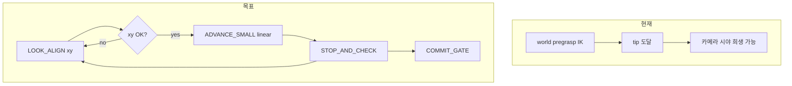

# Look-then-Advance Pick 제어 전환

## 문제 정리

현재 파이프라인은 **world pregrasp 위치 도달**이 1순위입니다.

- IK: [`engine/ik.py`](engine/ik.py) `solve_then_align()` → `solve_ik()`로 **위치 먼저**, 이후 `refine_direction_with_position_hold()`로 방향 미세 보정
- COARSE: [`host.py`](host.py) + [`engine/pick_view_pregrasp.py`](engine/pick_view_pregrasp.py) — 후보 IK + predicted FOV (개선됨)이지만 여전히 **grasp tip world 위치** 기준
- ALIGN: [`host.py`](host.py) L1165–1242 — `err = desired - mu` 3D를 joint에 heuristic 매핑(`x→theta1`, `y→theta2`, `z→linear`), **xy가 크면서도 z 성분으로 linear가 움직일 수 있음** → 진동/시야 이탈

4-DOF에서는 **“물체를 계속 본다”가 1순위**, world 위치는 참고값이어야 합니다.



---

## 제어 원칙 (고정)

| 우선순위 | 목표 |
|---------|------|
| 1 | 물체가 카더라 FOV 안 (`track_valid`, visibility) |
| 2 | `object_camera.x/y` → `desired_camera_xy` |
| 3 | `object_camera.z` → `desired_z` (접근) |
| 4 | world target (참고) |

**규칙:** `|error_x|`, `|error_y|` > threshold → **접근 금지**, LOOK만. LOST → **정지 + linear backoff + TARGET_LOCK**.

---

## 새 FSM (이름 변경 — 사용자 선택)

| 기존 | 신규 | 역할 |
|------|------|------|
| `SEARCH` | `TARGET_LOCK` | YOLO lock / tracker 안정 |
| `COARSE_WORLD_PREGRASP` | `VIEW_ALIGN` | 1회성 거친 관측 자세 (기존 view-pregrasp 후보 선택 유지) |
| `STOP_AND_RELOCALIZE` | `STOP_AND_CHECK` | 정지, μ/Σ 안정화, advance 직후 재측정 |
| `CAMERA_SERVO_ALIGN` | `LOOK_ALIGN` | camera xy visual servo만 (접근 없음) |
| *(신규)* | `ADVANCE_SMALL` | xy OK일 때만 `linear_m += step` |
| `CONFIDENCE_GATE` | `COMMIT_GATE` | track + xy/z + score 통과 시 blind approach 허용 |
| `SHORT_APPROACH` | `SHORT_APPROACH` | perception 무시 blind (유지) |
| `CLOSE_GRIPPER`, `LIFT_AND_VERIFY` | 동일 | 유지 |

**루프:**

```text
TARGET_LOCK → VIEW_ALIGN → LOOK_ALIGN ⇄ ADVANCE_SMALL → STOP_AND_CHECK → (반복) → COMMIT_GATE → SHORT_APPROACH → ...
```

`goto_stage`는 **구 이름 alias** 1개 릴리스만 허용 (예: `COARSE_WORLD_PREGRASP` → `VIEW_ALIGN`) 후 제거.

---

## Phase 1 — Visual servo 모듈 + LOOK_ALIGN / ADVANCE_SMALL (핵심)

### 1.1 신규 모듈 [`engine/pick_visual_servo.py`](engine/pick_visual_servo.py)

책임 분리 (테스트 가능):

- `camera_xy_error(mu, desired_xy) -> (ex, ey, norm_xy)`
- `look_align_ok(ex, ey, limits) -> bool`
- `compute_look_delta_q(q, ex, ey, gains, axis_map) -> SimQ` — **xy만** 조정, `linear` 고정
- `advance_allowed(ex, ey, limits) -> bool`
- `compute_advance_delta_q(q, step_m) -> SimQ` — **linear만** `+step_m`
- (Phase 1b) `estimate_jacobian_columns(...)` — ε perturb + 관측으로 `J` 추정, `dq = -λ pinv(J) e`

**Phase 1 초기 매핑 (고정 gain, 사용자 제안):**

```text
theta1 += kx * error_x
theta2 += ky * error_y
linear   += step_m  only if advance_allowed
```

gain/axis는 `config.ini` `[pick_fsm]`에 두고, 나중에 calibration JSON으로 교체 가능하게.

**진동 방지 (현 ALIGN 버그 대응):**

- 명령 주기: `look_cmd_period_s` (기본 0.15–0.25 s)
- deadband: `look_xy_deadband_m` (기본 8–10 mm)
- 개선 없음 N회 → `STOP_AND_CHECK` (기존 `align_no_improve_count` 재사용)
- **오차 개선 없으면 pending_target 갱신 안 함** (현재는 10 Hz로 계속 던짐)

### 1.2 [`host.py`](host.py) FSM 리팩터

- `PickStage` enum rename + `PickContext` 필드:
  - `look_axis_map` / `advance_step_m` / `backoff_step_m` / `advance_count`
- **`LOOK_ALIGN`**: `_pick_visual_servo_look_step()` — tracker OK 필수, xy servo만, `stage_error_m = norm_xy`
- **`ADVANCE_SMALL`**: 진입 시 1회 `linear += advance_step_m`, 즉시 `STOP_AND_CHECK`로 전이 (짧은 이동 + 반드시 재관측)
- **`STOP_AND_CHECK`**: 기존 relocalize 로직 유지, 성공 시 `LOOK_ALIGN`으로
- **LOST 처리** (모든 접근 단계): `track_state in LOST/SEARCH` → pending clear, `linear -= backoff`, `TARGET_LOCK`

`CAMERA_SERVO_ALIGN`의 3D heuristic step (L1233–1238) **삭제**.

### 1.3 [`engine/config_loader.py`](engine/config_loader.py) + [`config.ini`](config.ini)

추가 예시:

```ini
desired_camera_xy_m = 0.0, 0.0
desired_camera_z_m = 0.10
look_xy_threshold_m = 0.010
look_xy_deadband_m = 0.008
look_gain_theta1 = 1.0
look_gain_theta2 = 1.0
advance_step_m = 0.003
advance_backoff_m = 0.015
look_cmd_period_s = 0.20
commit_z_max_m = 0.06
```

`desired_camera_object` tuple은 `desired_camera_xy_m` + `desired_camera_z_m`로 분리해 UI/로그 명확화.

### 1.4 UI [`ui/panels/pick_fsm.py`](ui/panels/pick_fsm.py)

`_NEXT_STAGE_OPTIONS`를 새 stage 이름으로 갱신:

```text
TARGET_LOCK → VIEW_ALIGN
VIEW_ALIGN → STOP_AND_CHECK
STOP_AND_CHECK → LOOK_ALIGN
LOOK_ALIGN → ADVANCE_SMALL | STOP_AND_CHECK
ADVANCE_SMALL → (auto) STOP_AND_CHECK
...
COMMIT_GATE → SHORT_APPROACH
```

---

## Phase 2 — VIEW_ALIGN 역할 축소 + COMMIT 조건 강화

### 2.1 `VIEW_ALIGN` (구 COARSE)

- 기존 [`engine/pick_view_pregrasp.py`](engine/pick_view_pregrasp.py) 유지: **초기 FOV 확보 1회**
- 성공 조건: tip/q 도달 + `_pick_coarse_visibility_ok()` (유지)
- 성공 후 **`LOOK_ALIGN`으로** (바로 `STOP_AND_CHECK` 건너뛰지 않음 — 첫 관측 안정화)

### 2.2 `COMMIT_GATE` (구 CONFIDENCE_GATE)

통과 조건에 **xy 정렬** 추가:

```text
look_align_ok
AND track_confidence / depth_valid_ratio
AND object_camera.z <= commit_z_max_m
AND score / uncertainty
```

통과 시에만 `SHORT_APPROACH` (blind).

### 2.3 접근 루프 종료

- `object_camera.z <= commit_z_max_m` **AND** xy OK → `COMMIT_GATE`
- `advance_count >= max_advance_steps` 또는 timeout → soft fail / `TARGET_LOCK`

---

## Phase 3 (선택) — IK direction-priority 모드

사용자 제안 **방법 A**. Phase 1–2 안정 후 추가.

- [`engine/ik.py`](engine/ik.py): `solve_camera_priority(q, object_world, mu_camera, hand_eye, weights)` 
- Cost: `w_dir * ||mu_xy - desired||² + w_depth * (z - z_des)² + w_pos * ||tip - ref||² + w_reg * ||q-q_prev||²`
- `w_dir=10, w_depth=1, w_pos=0.2` (config)
- **VIEW_ALIGN** 후보 scoring에 strict FOV 대신 이 cost 사용 가능 (장기)

Phase 1에서는 **IK target position 생성 최소화** — LOOK/ADVANCE는 q-space만.

---

## 테스트

| 파일 | 내용 |
|------|------|
| [`tests/test_pick_visual_servo.py`](tests/test_pick_visual_servo.py) (신규) | xy gate, advance_allowed, deadband, delta_q 축 분리 |
| [`tests/test_pick_fsm.py`](tests/test_pick_fsm.py) | stage enum/alias, gate helpers |
| 기존 [`tests/test_pick_view_pregrasp.py`](tests/test_pick_view_pregrasp.py) | VIEW_ALIGN용 유지 |

---

## 마이그레이션 / 실행 체크리스트

1. `host.py`, `ctrl.py`, perception 재시작
2. Manual: `TARGET_LOCK` → perception `TRACKING_3D` → `VIEW_ALIGN` → `LOOK_ALIGN` (진동 없이 xy 수렴 확인) → auto loop
3. host 로그: `[pick] LOOK_ALIGN ex=... ey=...`, `[pick] ADVANCE_SMALL +3mm`, LOST 시 `[pick] backoff`

---

## 변경 파일 요약

| 파일 | 변경 |
|------|------|
| [`engine/pick_visual_servo.py`](engine/pick_visual_servo.py) | **신규** — Look/Advance q-step |
| [`host.py`](host.py) | Stage rename, FSM 루프, ALIGN heuristic 제거, LOST backoff |
| [`engine/config_loader.py`](engine/config_loader.py), [`config.ini`](config.ini) | visual servo 파라미터 |
| [`ui/panels/pick_fsm.py`](ui/panels/pick_fsm.py) | stage 버튼/그래프 |
| [`engine/pick_view_pregrasp.py`](engine/pick_view_pregrasp.py) | 변경 최소 (VIEW_ALIGN에서 호출) |
| [`engine/ik.py`](engine/ik.py) | Phase 3 only |

**의도적으로 하지 않을 것 (Phase 1):** 전역 IK solver를 position→direction 순서 자체를 뒤집지 않음 — pick 접근 구간은 q-space servo로 우회하고, VIEW_ALIGN 1회만 기존 IK 사용.
