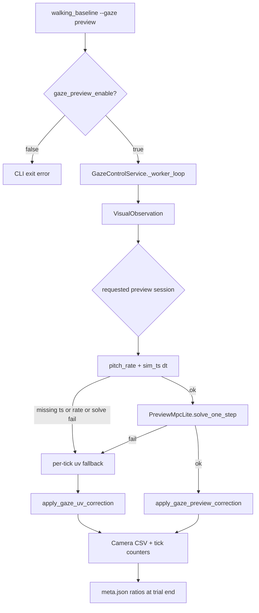

# Preview MPC-lite Gaze Mode

## Goal

Add a fourth gaze mode `preview` alongside `off` / `uv` / `uv_ff`. In preview mode, replace the P/D `apply_gaze_uv_correction` law with a **single-step** solve:

```text
du = -(Jᵀ Q J + R)⁻¹ Jᵀ Q (s + B_base · d̂)
```

- `s = [u_err, v_err]`
- `du = [Δroll, Δs1, Δs2]` (display units)
- `J` = 2×3 UV Jacobian (`default_uv_jacobian` from gaze gains)
- pitch-only preview: `B_base · d̂ = [0, b_pitch · pitch_rate_lead]ᵀ`
- `pitch_rate_lead = pitch_rate + τ · pitch_acc_est`
- `pitch_acc_est = (pitch_rate − pitch_rate_prev) / dt`
- **`b_pitch` sign is not assumed correct** — first experiment sweeps `+0.05` and `−0.05`



**Out of scope:** grasp/LJI/Look/Aim, stop-grasp demo, horizon MPC, `preview_model.py` multi-step horizon.

---

## Experiment safety / correctness (hard requirements)

### 1. CLI fail-fast vs runtime fallback

| Layer | Rule |
|-------|------|
| **Experiment tools** (`walking_baseline`, `demo_gaze_walking`, batch scripts) | `--gaze preview` **must exit with error** if `gaze_preview_enable=false` in loaded config. Message e.g. `preview requested but gaze_preview_enable=false in config.ini`. **Never** start a trial labeled `preview` that silently runs `uv`. |
| **Runtime worker** | Per-tick fallback to `uv` is allowed **only** when preview session is valid (`requested_gaze_mode=preview` AND `gaze_preview_enable=true`) and a tick fails due to missing signals or solve error. Each fallback tick logs `preview_fallback=1` + reason. |

Implementation:
- [`tools/walking_baseline.py`](tools/walking_baseline.py): after `load_app_config_from_ini`, check before `_run_trial`
- [`tools/demo_gaze_walking.py`](tools/demo_gaze_walking.py): same check
- [`tools/run_walking_baseline_batch.py`](tools/run_walking_baseline_batch.py): inherit via walking_baseline or duplicate check
- **Remove** any design that maps disabled preview → uv at worker start without CLI error

### 2. `meta.json` provenance fields

Extend [`RunContext`](engine/experiment/run_context.py) / trial finalization in [`walking_baseline._run_trial`](tools/walking_baseline.py):

| Field | When set | Meaning |
|-------|----------|---------|
| `requested_gaze_mode` | trial start | CLI `--gaze` value |
| `actual_gaze_mode` | trial end | `"preview"` if `preview_used_ratio >= 0.5`, else `"uv"` when requested was `preview`; otherwise equals requested |
| `preview_enable` | trial start | bool from `gaze_preview_enable` in loaded config |
| `preview_used_ratio` | trial end | `preview_used_ticks / gaze_ticks` |
| `preview_fallback_ratio` | trial end | `preview_fallback_ticks / gaze_ticks` |

**Tick counters** in [`GazeControlService`](engine/controller/gaze_service.py):
- Increment on each gaze worker tick with valid observation
- `preview_used` tick when preview solve applied
- `preview_fallback` tick when uv fallback applied (with reason enum → string)

Write flow:
1. `write_meta()` at trial start with `requested_gaze_mode`, `preview_enable`, placeholders for ratios
2. On `stop_gaze_stabilizer()` / end of `_run_trial`, read counters from gaze service and **rewrite/update** `{run_id}_meta.json` with final ratios and `actual_gaze_mode`

Keep existing `gaze_mode` field for backward compat (= `requested_gaze_mode`).

### 3. Camera CSV fields

Extend `CAMERA_CSV_FIELDS` in [`walking_metrics.py`](engine/go2_mpc/walking_metrics.py):

**Provenance (required):**
```text
preview_used, preview_fallback, preview_fallback_reason, preview_dt_s
```

**Diagnostics (from original plan):**
```text
pitch_rate, pitch_rate_lead, pitch_acc_est, b_pitch, preview_term_v,
du_roll, du_s1, du_s2, preview_solve_time_ms
```

- `preview_used` / `preview_fallback`: `0/1` per sample
- `preview_fallback_reason`: empty when not fallback; else short code (`missing_ts`, `missing_pitch_rate`, `solve_fail`, `disabled` should never appear if CLI gate works)
- `preview_dt_s`: sim timestamp delta used by pitch lead estimator for that tick (empty if N/A)
- Non-preview modes (`off`/`uv`/`uv_ff`): leave preview columns empty or `0` with `preview_used=0`

### 4. Pitch lead `dt` source

In [`preview_lite.py`](engine/gaze_stabilizer/preview_lite.py) `PitchLeadEstimator`:

```python
dt = go2_base_timestamp_s - prev_go2_base_timestamp_s   # primary
if dt <= 0 or not finite: dt = worker_period_s         # fallback only
pitch_acc_est = (pitch_rate - pitch_rate_prev) / dt
```

- Store `_prev_go2_base_timestamp_s` and `_prev_pitch_rate` on estimator (reset on gaze stop)
- Log `preview_dt_s` to camera CSV each tick
- Worker `period = 1/gaze_hz` is **fallback only**, not primary

**`pitch_rate` source (priority):**
1. `host.go2_base_ang_vel_body[1]` when `go2_base_timestamp_s > 0`
2. Else differentiate `host.go2_base_rpy[1]` using sim-ts `dt`

**Per-tick runtime fallback triggers (→ uv for that tick only):**
- `host` is None
- `go2_base_timestamp_s <= 0`
- `pitch_rate` unavailable

### 5. First experiment: `b_pitch` sign sweep

`b_pitch` coupling sign is **not validated**. Before comparing preview vs uv broadly, run minimal sign check:

| Run | Config change | run prefix example |
|-----|---------------|------------------|
| A | `gaze_preview_enable=true`, `gaze_preview_b_pitch=+0.05` | `exp_gaze_preview_bp05` |
| B | `gaze_preview_enable=true`, `gaze_preview_b_pitch=-0.05` | `exp_gaze_preview_bn05` |

- Same motion/preset/duration as prior ablation (`neutral`, `forward`, 60s, headless)
- Compare `v_rms`, `preview_used_ratio`, `preview_fallback_ratio`, and `preview_term_v` sign vs pitch_rate_lead
- Pick sign with lower `v_rms` (and stable `preview_used_ratio`) for subsequent preview experiments

---

## Files to change

| Area | File |
|------|------|
| One-step solver | [`engine/gaze_stabilizer/preview_mpc.py`](engine/gaze_stabilizer/preview_mpc.py) |
| Pitch lead + dt | new [`engine/gaze_stabilizer/preview_lite.py`](engine/gaze_stabilizer/preview_lite.py) |
| Config | [`engine/gaze_stabilizer/config.py`](engine/gaze_stabilizer/config.py), [`engine/config_loader.py`](engine/config_loader.py), ini files |
| Runtime wiring | [`engine/controller/gaze_service.py`](engine/controller/gaze_service.py) |
| Apply du | [`engine/controller/actions.py`](engine/controller/actions.py) — `apply_gaze_preview_correction()` |
| Meta provenance | [`engine/experiment/run_context.py`](engine/experiment/run_context.py), [`tools/walking_baseline.py`](tools/walking_baseline.py) |
| CLI safety | [`tools/walking_baseline.py`](tools/walking_baseline.py), [`tools/demo_gaze_walking.py`](tools/demo_gaze_walking.py) |
| Logging | [`engine/go2_mpc/walking_metrics.py`](engine/go2_mpc/walking_metrics.py) |

---

## 1. Config: `GazeStabilizerConfig` + INI

| Field | INI key | Default |
|-------|---------|---------|
| `preview_enable` | `gaze_preview_enable` | `false` |
| `preview_tau_s` | `gaze_preview_tau_s` | `0.08` |
| `preview_b_pitch` | `gaze_preview_b_pitch` | `0.05` |
| `preview_q_u/v` | `gaze_preview_q_u/v` | `1.0` |
| `preview_r_roll/s1/s2` | `gaze_preview_r_roll/s1/s2` | `0.01` |
| `preview_max_du_roll` | `gaze_preview_max_du_roll` | fallback `gaze_max_du_roll` |
| `preview_max_du_seg` | `gaze_preview_max_du_seg` | fallback `gaze_max_seg_du_per_tick` |
| `preview_lowpass_alpha` | `gaze_preview_lowpass_alpha` | `0.35` |

---

## 2. `PreviewMpcLite` one-step solver

[`preview_mpc.py`](engine/gaze_stabilizer/preview_mpc.py): `solve_preview_du()` → `PreviewSolveResult(du, preview_term_v, solve_time_ms, ok, reason)`.

`H = Jᵀ Q J + R`, `du = −H⁻¹ Jᵀ Q (s + preview_term)`. `LinAlgError` / non-finite → `ok=False`.

---

## 3. Gaze worker integration

[`start_walking_gaze`](engine/controller/gaze_service.py): `preview` branch sets `enable_base_ff=False`, stores `_gaze_mode="preview"`.

[`_worker_loop`](engine/controller/gaze_service.py):
- If `_gaze_mode == "preview"`: try `_apply_preview_step()`; on failure per tick → `apply_gaze_uv_correction` + log fallback
- No `extra_du` / base FF in preview ticks
- Expose `preview_tick_stats()` for meta finalization

[`apply_gaze_preview_correction`](engine/controller/actions.py): apply clipped `du`, **linear fixed**, partial roll/s1/s2 only.

---

## 4. Safety checklist

- CLI fail-fast when `preview` requested but `gaze_preview_enable=false`
- Runtime uv fallback per-tick only (never relabel trial as preview)
- Clip `du` by preview + existing gaze limits; linear never commanded
- No grasp/LJI/Look/Aim changes

---

## 5. Tests

| Test | Coverage |
|------|----------|
| `test_preview_mpc_lite.py` | solve math, singular H, preview_term sign |
| `test_preview_mpc_dims.py` | 1-step smoke (replace NotImplemented) |
| `test_gaze_stabilizer.py` | PitchLeadEstimator uses sim-ts dt; worker period fallback |
| `test_walking_baseline.py` (new/extend) | `--gaze preview` + `preview_enable=false` → SystemExit |
| `test_run_context.py` (extend) | meta fields present after trial |
| `test_walking_metrics.py` (extend) | new camera CSV columns |

---

## Default ini snippet

```ini
# Preview MPC-lite (one-step; requires gaze_preview_enable=true for --gaze preview)
gaze_preview_enable = false
gaze_preview_tau_s = 0.08
gaze_preview_b_pitch = 0.05
gaze_preview_q_u = 1.0
gaze_preview_q_v = 1.0
gaze_preview_r_roll = 0.01
gaze_preview_r_s1 = 0.01
gaze_preview_r_s2 = 0.01
gaze_preview_max_du_roll = 1.0
gaze_preview_max_du_seg = 1.5
gaze_preview_lowpass_alpha = 0.35
```
