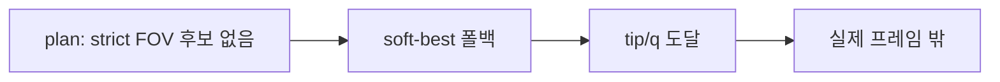

# VIEW_ALIGN visibility-first 수정

## 진단 (현재 코드)

이미 있는 것 ([`host.py`](host.py) `_pick_plan_view_pregrasp`, [`engine/pick_view_pregrasp.py`](engine/pick_view_pregrasp.py)):

- 후보별 IK → `world_point_to_camera(q)` → `camera_visibility_score`
- 도착 후 `_pick_coarse_visibility_ok()` (live tracker 또는 FK 예측)

**실패 원인 (스크린샷과 일치):**



1. **soft-best 폴백** ([`host.py`](host.py) L911–918): strict FOV 통과 후보가 없어도 점수만 높은 후보로 이동 → position-align
2. **성공 전이**: tip/q 도달 + visibility OK 시 **바로 `LOOK_ALIGN`** (L1288–1290), `STOP_AND_CHECK` 생략
3. **`target_dir` 축 불일치**: `look_dir_world = normalize(obj - pregrasp)` → IK는 [`engine/iklib/kinematics.py`](engine/iklib/kinematics.py) `_forward_direction_world`로 **grasp/tip 접근축**만 refine. camera optical +z와 무관
4. **빨간 마커** = `pregrasp_world` (tip target). camera pose 목표가 아님
5. **`[view_candidate]` 로그 없음** — look_dot / visible_pred 원인 분리 불가

Hand-eye 축 ([`configs/hand_eye.node9_mount.json`](configs/hand_eye.node9_mount.json)): camera +z = look, node9 +x = forward.

---

## 목표 동작

```text
VIEW_ALIGN 후보 N개
  → IK (position 우선)
  → p_camera_pred + look_dot 평가
  → strict 통과 후보만 선택 (없으면 이동 안 함)
  → tip/q 도달
  → STOP_AND_CHECK (track_valid)
  → LOOK_ALIGN 루프
```

사용자 선택: **strict 미달 시 reject** (soft-best 기본 비활성).

---

## 구현 계획

### 1. 후보 평가 API 확장 — [`engine/pick_view_pregrasp.py`](engine/pick_view_pregrasp.py)

신규 타입/함수:

- `ViewCandidateMetrics`: `p_camera`, `visible_pred`, `look_dot`, `score`, `camera_world`, `camera_look`, `object_dir`
- `evaluate_view_candidate(q, object_world, hand_eye, ik_context, limits, desired_xy)`:
  - `p_camera_pred = world_point_to_camera(q, object_world)`
  - `camera_world, camera_look, _ = camera_axes_world(...)` ([`hand_eye.py`](addons/perception_bridge/hand_eye.py) L72–84, +z = look)
  - `object_dir = normalize(object_world - camera_world)`
  - `look_dot = dot(normalize(camera_look), object_dir)`
- `view_candidate_passes(metrics, *, limits, look_dot_min=0.85)`:
  - `visible_pred` (기존 `camera_visibility_ok`)
  - `look_dot >= look_dot_min` (config, 기본 0.85)
- `view_candidate_score(metrics, desired_xy, limits)`:
  - `-( |x-desired_x| + |y-desired_y| + depth_penalty )` (strict 통과 후보 간 정렬)

후보 생성 확장:

- `view_distance_m` 단일값 → `view_distances_m: (0.45, 0.55)` 등 config 리스트
- 기존 lateral/height grid 유지

### 2. VIEW_ALIGN 플래닝 수정 — [`host.py`](host.py)

`_pick_plan_view_pregrasp` 변경:

| 현재 | 변경 |
|------|------|
| `camera_visibility_score` only | `evaluate_view_candidate` + `look_dot` gate |
| soft-best fallback | **제거** (strict 0개 → `None` 반환) |
| `solve_then_align(..., look_dir_world=cand.look_dir)` | **position-only IK** (`target_dir_world=None`) — 방향은 score로만 판단 (grasp 축과 camera +z 혼동 방지) |
| 선택 후 1줄 print | **`[view_candidate]`** per 후보 + 선택 요약 |

로그 형식 (사용자 요청):

```text
[view_candidate] tag=view_+0.00_+0.00_+0.05 q=[...] target_pos=[...] camera_world=[...] camera_look=[...] object_world=[...] object_dir=[...] look_dot=0.92 p_camera_pred=[x,y,z] visible_pred=true score=-0.03
[view_align] selected tag=... look_dot=... visible_pred=... (N strict / M total)
```

`_pick_execute_coarse_pregrasp`: plan `None` 시 명확한 메시지 (`view_align_no_strict_candidate`).

### 3. FSM 전이 수정 — [`host.py`](host.py) `VIEW_ALIGN` 블록

```python
# 현재 (L1288-1290)
reached and visibility -> LOOK_ALIGN

# 변경
reached and visibility -> STOP_AND_CHECK
# STOP_AND_CHECK 성공 (track_valid, uncertainty OK) -> LOOK_ALIGN
# STOP_AND_CHECK 실패 -> VIEW_ALIGN 재플랜 또는 failed tag blacklist
```

- **도달 성공 조건**: tip/q reach 유지하되, `_pick_coarse_visibility_ok()`는 **plan 시점 `coarse_predicted_camera` + live** 모두 고려 (이미 부분 구현)
- 도착했는데 live visibility 실패: 기존처럼 `coarse_failed_tags` + replan, timeout 시 hard_fail
- `VIEW_ALIGN`은 “대략 프레임 안”만 목표 — 완벽 정렬은 `LOOK_ALIGN`에 위임 (사용자 의도와 일치)

### 4. 설정 — [`engine/config_loader.py`](engine/config_loader.py), [`config.ini`](config.ini)

```ini
view_distances_m = 0.45, 0.55
view_look_dot_min = 0.85
view_allow_soft_fallback = false   # 기본 false, 코드에서 soft 경로 제거 시 무시 가능
view_log_all_candidates = true     # [view_candidate] 전체 출력
```

기존 `view_camera_*` FOV 한계는 그대로 사용.

### 5. 디버그 마커 (선택, 낮은 비용)

선택된 후보에 대해 sim에서 원인 분리용:

- `view_align_camera` — `camera_world` (파란 점)
- `view_align_camera_look` — look 방향 화살표
- `pregrasp_target` — tip (빨간 점, 기존 유지)

→ “빨간 점만 보고 판단”하는 혼동 완화.

### 6. 테스트 — [`tests/test_pick_view_pregrasp.py`](tests/test_pick_view_pregrasp.py)

- `look_dot` gate: 높은 dot 통과, 낮은 dot 거부
- strict-only selection: visible 후보 없으면 `pick_best_visible_candidate` → `None`
- score ordering: 중심에 가까운 p_camera가 더 높은 score

---

## 의도적으로 Phase 3로 미룸

- **camera pose → tip IK target 역변환** (hand-eye inverse로 desired `T_world_camera` 생성): 후보 grid + position-only IK + look_dot으로 대부분 해결 가능. 효과 부족 시 별도 PR.
- **IK `solve_direction_priority`**: 기존 Look-then-Advance 계획 Phase 3.

---

## 검증 체크리스트

1. `host.py` 재시작 후 Manual `VIEW_ALIGN`
2. host 로그에서 **모든 후보** `[view_candidate]` 확인
3. 실패 케이스에서 `look_dot` vs `visible_pred`로 원인 분류:
   - `visible_pred=false` → FOV/후보 geometry
   - `visible_pred=true` but 실제 안 보임 → hand-eye/FK
   - `look_dot` 낮음 → grasp direction IK 이슈 (position-only로 완화 기대)
4. strict 후보 0개면 **로봇 미이동** + ack/로그 실패
5. 성공 시 `STOP_AND_CHECK` → `TRACKING_3D` 확인 후 `LOOK_ALIGN`
