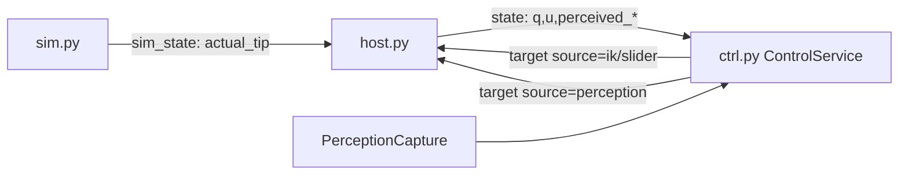
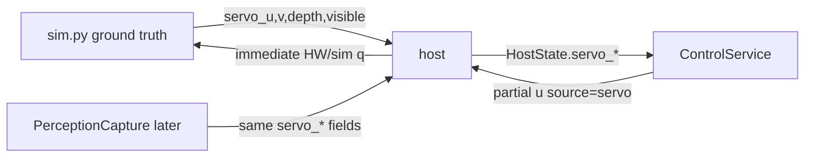

# Visual Servo Pipeline 구현 계획

## 현재 아키텍처 (변경 전)



- **sim → host**: [`HostFeedbackPublisher.send_actual_tip()`](sim.py)만 전송 (L1067–1092)
- **perception**: controller → host (`source=perception`) → `last_perceived_*` → `pack_state`
- **quintic**: [`host._use_trajectory_for_source()`](host.py) — `"ik"`만 true (L158–162)
- **즉시 실행**: `"slider"` / partial `u` → `_cancel_trajectory()` → `_apply_partial_u_target()`
- **기존 Aim 루프**: [`start_aim()`](engine/controller/actions.py) — UV Jacobian + `source="slider"` + `_pick_aim_settle_s` (0.08s)

## 목표 아키텍처



ControlService는 `servo_source`만 보고 sim/real을 구분하지 않습니다.

---

## 1. Simulated perception (`sim.py`)

### 새 모듈: [`engine/sim_perception.py`](engine/sim_perception.py) (신규, ~80줄)

테스트 가능한 순수 함수:

```python
def project_pinhole(x_cam, y_cam, z_cam, *, fx, fy, cx, cy, width, height) -> SimServoFeature:
    # Z <= 0 or u/v out of bounds → visible=False, confidence=0
    # else u=fx*X/Z+cx, v=fy*Y/Z+cy, depth=Z, confidence=1.0
```

카메라 pose 계산은 Genesis link pose + hand-eye:

- [`SimScene.link_pose_world(link_name)`](sim.py) 신규 — `entity.get_link()` pos/quat → world `(p, R)` (기존 `actual_tip_world` 패턴 재사용, L231–255)
- `T_world_camera = T_world_node9 @ T_node9_camera` ([`hand_eye.load_hand_eye_transform`](addons/perception_bridge/hand_eye.py))
- object world → camera: `p_cam = inv(T_world_camera) @ p_world`

### Object pose 소스 (우선순위)

1. config `[visual_servo] target_object_xyz` (기본 `(0.5, 0.0, 1.2)` — [`PanelState.mock_object_*`](engine/controller/state.py)와 동일)
2. host debug_markers 중 `perceived_object` / `pick_target_object` 이름 (sim 루프에서 이미 markers 수신, L1374–1407)
3. fallback: config default

Genesis scene에 optional target sphere spawn은 **하지 않음** (pose-only로 충분; debug marker로 시각화 가능).

### Feedback 전송 확장

[`HostFeedbackPublisher`](sim.py) (L1055):

- `send_actual_tip()` → `send_sim_feedback(...)` 로 확장 (backward-compatible: `actual_tip` 유지)
- sim perception enabled 시 추가 필드:

```python
{
  "servo_visible": bool,
  "servo_u": float | null,
  "servo_v": float | null,
  "servo_depth": float | null,
  "servo_confidence": float,
  "servo_source": "sim",
}
```

### Sim 루프 삽입점

[`SimRuntime.run()`](sim.py) L1367 — `send_actual_tip` 직후:

```python
if sim_perception_enabled and feedback_pub:
    feature = compute_sim_servo_feature(app, object_xyz)
    feedback_pub.send_sim_feedback(sim_tip, sim_tip_dir, servo=feature)
```

### Sim 초기화

[`sim.py main()`](sim.py) + [`GenesisApp.__init__`](sim.py):

- `hand_eye_config` path는 이미 [`SimConfig`](engine/config_loader.py)에 있음 (L47)
- `VisualServoConfig` 로드 후 app에 전달
- sim perception용 intrinsics는 `[visual_servo]`의 `image_width/height`, `center_u/v`에서 fx/fy 추정 또는 별도 `fx/fy` 키 추가 (mock RealSense 값 `fx=fy=615` 참고)

---

## 2. Host state protocol 확장

### [`engine/protocol.py`](engine/protocol.py) — `pack_state()` (L131)

optional kwargs 추가 (None이면 JSON 키 생략 → backward-compatible):

```python
servo_visible, servo_u, servo_v, servo_depth, servo_confidence, servo_source
```

### [`host.py`](host.py)

**상태 저장** (L89 근처, `last_perceived_*` 옆):

```python
last_servo_visible = False
last_servo_u/v/depth = None
last_servo_confidence = 0.0
last_servo_source = "none"
```

**`_handle_sim_feedback()`** (L943): `servo_*` 키 파싱 → 위 필드 갱신 → `_broadcast_state_now()` (즉시 ctrl에 반영)

**`_broadcast_state_now()` / periodic `pack_state`** (L554, L1378): servo 필드 포함

**Real perception hook (stub, ~15줄)**: `_handle_msg` perception 분기 (L1059) 끝에 `_update_servo_from_real_perception()` 호출 — pixel u/v를 `image_width/height`로 변환, depth는 `perceived_object_camera[2]`, `servo_source="real"`. 완전 통합은 후속; 구조만 마련.

### [`engine/controller/state.py`](engine/controller/state.py) — `HostState`

```python
servo_visible: bool = False
servo_u: Optional[float] = None
servo_v: Optional[float] = None
servo_depth: Optional[float] = None
servo_confidence: float = 0.0
servo_source: str = "none"
```

기존 `perceived_*` 필드 **변경 없음**.

### [`engine/controller/client.py`](engine/controller/client.py)

- `last_servo_*` 캐시 + `_update_servo_fields(msg)` (ack/state 모두, `_update_perception_fields`와 분리)
- `get_state()`에 포함

---

## 3. `source="servo"` 명령 타입

### [`host.py`](host.py) — 최소 변경

```python
def _is_allowed_source(self, source: str) -> bool:
    return str(source) in ("slider", "ik", "sim", "target", "perception", "servo")
```

**`_use_trajectory_for_source`는 수정하지 않음** — `"servo"`는 quintic 미사용 (slider와 동일).

partial `u` / full `q` 모두 기존 `_cancel_trajectory()` 경로를 탐. 주석 추가:

```python
# source="servo": closed-loop visual servo — immediate partial u, no quintic (same as slider)
```

### [`engine/controller/actions.py`](engine/controller/actions.py)

```python
def apply_partial_control_u(self, partial_u, *, source: str = "slider") -> None:
    ...
    self.client.send_partial_control_u(adjusted, source=source)
```

Visual servo worker는 **`_send_display_control_u_and_wait` / `_grasp_wait_waypoint_settle` 사용 금지**.

---

## 4. Visual servo worker (`ControlService`)

### Config: [`VisualServoConfig`](engine/config_loader.py) + [`config.ini`](config.ini)

사용자 제안 `[visual_servo]` 섹션 그대로 추가. `AppConfigBundle`에 `visual_servo_config` 필드 추가.

### Worker 스레드 (신규, `_pick_worker`와 분리)

[`ControlService.__init__`](engine/controller/actions.py):

```python
self._visual_servo_worker: Optional[threading.Thread] = None
self._visual_servo_stop = threading.Event()
```

`_visual_busy()` 확장: visual servo worker 포함.

**Public API** ([`engine/controller/actions.py`](engine/controller/actions.py)):

```python
def start_visual_servo_align(self) -> None: ...
def stop_visual_servo_align(self) -> None: ...
def visual_servo_running(self) -> bool: ...
```

### `_visual_servo_worker()` 로직

```python
while not stop and elapsed < timeout_s:
    host = client.refresh_state()
    # Read unified fields — NOT perceived_*
    if not host.servo_visible or host.servo_confidence < min_confidence:
        if lost_elapsed > lost_timeout_s: fail("lost target")
        continue  # no aggressive motion
    e_u = host.servo_u - center_u
    e_v = host.servo_v - center_v
    e_z = host.servo_depth - desired_depth_m
    if converged: success; break
    du_linear = sign_z * (-k_z_linear * e_z)
    du_roll   = sign_u * (-k_u_roll * e_u)
    du_s1     = sign_v1 * (-k_v_s1 * e_v) * bend_scale
    du_s2     = sign_v2 * (-k_v_s2 * e_v) * bend_scale
    # clamp to max_du_*
    current_u = current_control_u()
    partial = {
        "linear": current_u.u_linear + du_linear,
        "roll":   current_u.u_roll + du_roll,
        "s1":     current_u.u_s1 + du_s1,
        "s2":     current_u.u_s2 + du_s2,
    }
    apply_partial_control_u(partial, source="servo")
    state.set_pick_status(phase="visual_servo_align", msg=f"e_u={e_u:.1f} ...")
    time.sleep(servo_period_s)
```

안전 체크: `host.safety_fault`, `stop` event, e-stop 시 즉시 종료.

### Phase enum

[`ObjectPickPhase`](engine/controller/object_pick.py)에 추가:

```python
VISUAL_SERVO_ALIGN = "visual_servo_align"
```

E2E 파이프라인 **전면 수정 없음**. [`start_look_aim_grasp_e2e()`](engine/controller/actions.py)에는 주석 + TODO hook만 (acquire 후 `start_visual_servo_align` 호출 가능 지점 표시). 수동 UI 버튼으로 먼저 검증.

---

## 5. UI ([`ui/panels/perception.py`](ui/panels/perception.py))

"Visual Servo (debug)" 섹션 추가:

| UI | 동작 |
|----|------|
| Start Visual Servo Align | `service.start_visual_servo_align()` |
| Stop Visual Servo | `service.stop_visual_servo_align()` |
| Status display | `host_state.servo_*` + worker가 계산한 `e_u, e_v, e_z`, `pick_phase` |

[`ControlPanel.run()`](ui/control_panel.py)에서 이미 `refresh_host_state()` 호출 → panel에서 `_host_state.servo_u` 등 표시.

---

## 6. Wiring ([`ctrl.py`](ctrl.py))

```python
service = ControlService(..., visual_servo_cfg=bundle.visual_servo_config)
```

---

## 7. 테스트 (최소)

신규 [`tests/test_sim_perception.py`](tests/test_sim_perception.py):

- pinhole projection: in-bounds / behind camera / out-of-bounds
- `host._is_allowed_source("servo") == True`
- `pack_state` / client round-trip for `servo_*` fields

기존 IK/grasp/slider 테스트는 변경 없음 → 회귀 없음.

---

## 파일 변경 요약

| 파일 | 변경 |
|------|------|
| [`config.ini`](config.ini) | `[visual_servo]` 섹션 추가 |
| [`engine/config_loader.py`](engine/config_loader.py) | `VisualServoConfig` + loader |
| [`engine/sim_perception.py`](engine/sim_perception.py) | **신규** — pinhole + feature dataclass |
| [`sim.py`](sim.py) | link pose, feedback 확장, perception loop |
| [`engine/protocol.py`](engine/protocol.py) | `pack_state` servo fields |
| [`host.py`](host.py) | servo state, sim feedback, source=servo, real hook stub |
| [`engine/controller/state.py`](engine/controller/state.py) | `HostState` servo fields |
| [`engine/controller/client.py`](engine/controller/client.py) | parse servo fields |
| [`engine/controller/actions.py`](engine/controller/actions.py) | worker + `apply_partial_control_u(source=)` |
| [`engine/controller/object_pick.py`](engine/controller/object_pick.py) | `VISUAL_SERVO_ALIGN` phase |
| [`ui/panels/perception.py`](ui/panels/perception.py) | debug UI |
| [`ctrl.py`](ctrl.py) | config pass-through |
| [`tests/test_sim_perception.py`](tests/test_sim_perception.py) | **신규** |

---

## 검증 시나리오 (Acceptance)

1. `use_hardware=false`, sim + ctrl + host 실행
2. `[visual_servo] enabled=true`, target object config 설정
3. Look IK로 대략 object 방향 정렬 (수동)
4. UI "Start Visual Servo Align" → `pick_phase=visual_servo_align`
5. host log에 `source=servo` partial u 명령 확인 (quintic 없음)
6. UI에서 `e_u, e_v, e_z` 감소 관찰
7. tolerance 도달 시 `done` / success
8. object를 FOV 밖으로 → `lost target` 후 안전 정지
9. 기존 Aim/Grasp/Slider 동작 smoke test

---

## 의도적으로 하지 않는 것 (이번 마일스톤)

- Genesis render / YOLO / image Jacobian
- E2E pick pipeline 전면 재작성
- `perceived_*` 필드 대체 또는 제거
- sim.py에 visual servo controller 배치
